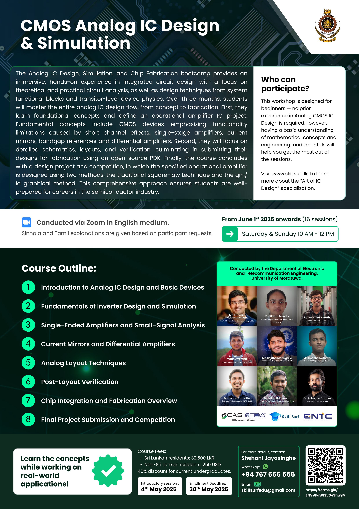

# 8. Course Outline

## Short description: 

The Analog IC Design, Simulation, and Chip Fabrication bootcamp provides an immersive, hands-on experience in integrated circuit design with a focus on theoretical and practical circuit analysis, as well as design techniques from system functional blocks and transitor-level device physics. Over three months, students will master the entire analog IC design flow, from concept to fabrication. First, they learn foundational concepts and define an operational amplifier IC project. Fundamental concepts include CMOS devices emphasizing functionality limitations caused by short channel effects, single-stage amplifiers, current mirrors, bandgap references and differential amplifiers. Second, they will focus on detailed schematics, layouts, and verification, culminating in submitting their designs for fabrication using an open-source PDK. Finally, the course concludes with a design project and competition, in which the specified operational amplifier is designed using two methods: the traditional square-law technique and the gm/Id graphical method. This comprehensive approach ensures students are well-prepared for careers in the semiconductor industry.

## Outline:
- **Introduction to Analog IC Design and Basic Devices:**
    - Overview of the analog design ecosystem, MOS device physics, schematic and layout basics (NMOS/PMOS).
- **Fundamentals of Inverter Design and Simulation:**
    - Hands-on design of inverters using OSIC tools, schematic simulations with Xschem/ngspice, and basic layout using KLayout.
- **Single-Ended Amplifiers and Small-Signal Analysis:**
    - Theory, design, and schematic simulations of single-ended amplifiers; introduction to small-signal modelling and analysis.
- **Current Mirrors and Differential Amplifiers:**
    - Design principles, schematic simulations, and theoretical understanding of current mirrors and differential amplifiers.
- **Analog Layout Techniques:**
    - Layout design theory, including transistor layouts, matching techniques, and hands-on practice with KLayout and DRC.
- **Post-Layout Verification:**
    - Running LVS and PEX checks, OTA layout tasks, and post-layout simulation preparation.
- **Chip Integration and Fabrication Overview:**
    - Finalizing designs with I/O planning, guard rings, filler cells, and understanding CMOS fabrication, chip packaging, and submission processes.
- **Final Project Submission and Competition:**
    - Final project reviews, amplifier performance benchmarking (Area/Power/GBP), preparation for tapeout, and best design award competition.

## Learning Outcomes: 
- **Understand the fundamental concepts of analog CMOS IC design:**
    - Develop a solid understanding of analog CMOS IC design flow, including MOS device behaviour and characteristics (NMOS and PMOS).
- **Design and Simulate Analog Building Blocks:**
    - Understand and design basic analog IC components such as inverters, current mirrors, single-ended amplifiers, and differential amplifiers using schematic and simulation tools like Xschem and ngspice.
- **Apply Layout Techniques for Analog Circuits:**
    - Create accurate transistor-level layouts using KLayout, perform DRC/LVS/PEX verification, and understand critical layout practices including matching, guard rings, and filler cell integration.
- **Develop and Verify a Full Custom Analog Circuit Project:**
    - Complete a full analog IC design project from schematic design through post-layout simulation, preparing the design for fabrication submission to a multi-project wafer (MPW) service.
- **Demonstrate Practical Understanding of Fabrication and Packaging:**
    - Understand CMOS fabrication processes, chip packaging techniques, and integrate test plans with PCB interfacing for final taped-out ICs.

<figure>
  
  <figcaption><em>Figure 8.1.1: CMOS Analog IC Design and Simulation.</em></figcaption>
</figure>