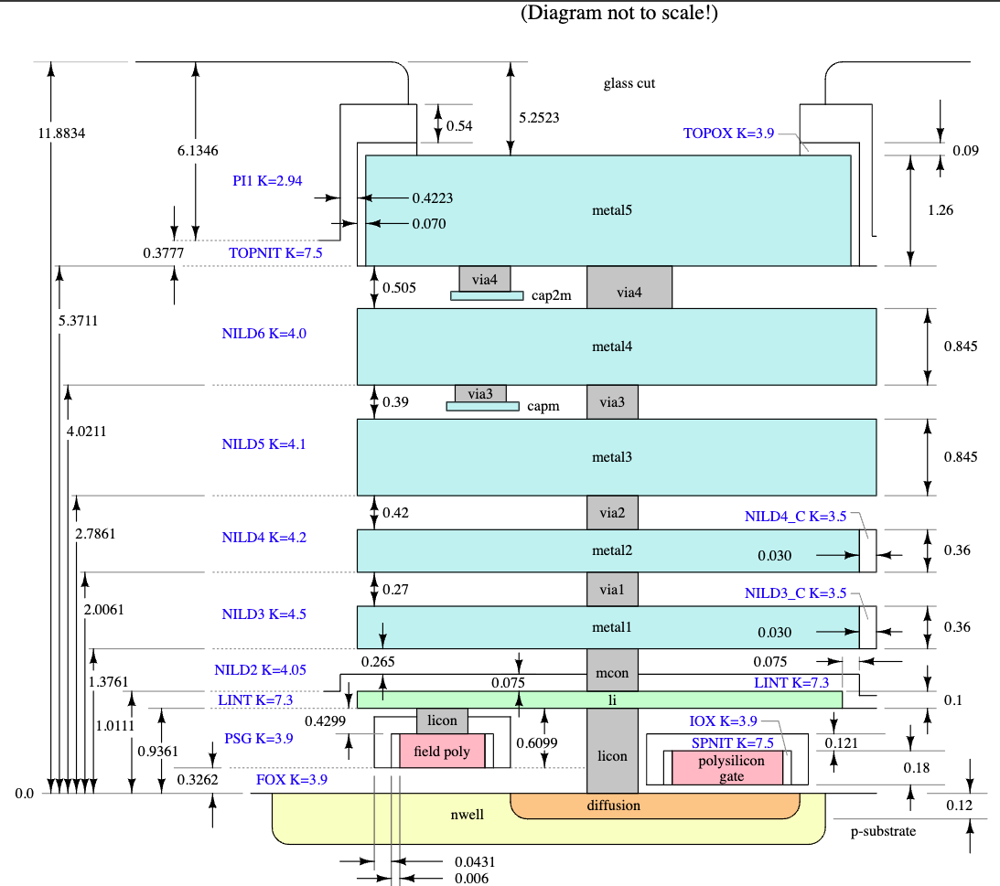

# 1.2 Introduction to the PDKs

{: .no_toc }

<details open markdown="block">
  <summary>
    Table of contents
  </summary>
  {: .text-delta }
- TOC
{:toc}
</details>

## Introduction to PDK

A Process Design Kit (PDK) is a crucial component in the semiconductor industry, used to model a fabrication process for the design tools that are used to create an integrated circuit. The PDK is created by the foundry, which defines a certain technology variation for their processes. It is then passed on to their customers to use in the design proces. 

Previously, PDK data is proprietary which is protected behind the non-disclosure agreement. Proprietary PDK data and commercial EDA tools are two main roadblocks in Integrated Circuit Design and Collaboration because it prevents the design to be shared among partners.

Open-source PDK for Skywater 130nm Technology was released as a result of a collaboration between SkyWater, Efabless, and Google. It’s based on SkyWater’s 130nm CMOS technology. The partnership gave designers worldwide free access to design technology to create new, manufacturable designs. The open-source PDK can be used to share designs and to collaborate among partners. A large number of designs has been published as open-source design using this PDK in Google Open MPW program through Efabless.

The SKY130 PDK is unique because it’s the industry’s first open-source PDK. It has revolutionized technology realization by lowering barriers to IC design. It has also paved a new path for global workforce development.

The SKY130 PDK is targeted at the SKY130 process node. More advanced technology nodes may become available in the future. The SkyWater Open Source PDK documentation can be found at their official website.

The use of open-source PDKs like SKY130 has significantly reduced the cost of IC design, making it accessible to more people. The Google-sponsored Open Multi Project Wafer, or Open MPW, Shuttle Program has enabled market-relevant designs to be fabricated by people who traditionally would not have had the opportunity to design a chip.

## Contents of a PDK

A typical PDK contains:
- A primitive device library: a collection of basic components that are used in the design process.
- Symbols: graphical representations of the components in the library.
- Device parameters: specific characteristics of the devices in the library.
- PCells or parameterized cells which are circuit elements that can be adjusted based on the needs of the design.
- Verification checks including Design Rule Checking (DRC), Layout Versus Schematic (LVS), Antenna and Electrical rule check.
- Technology data including layers, layer names, layer/purpose pairs, colors, fills, and display attributes.
- Process constraints: the limitations imposed by the fabrication process.
- Technology files for EDA tools.
- Simulation models of primitive devices (SPICE or SPICE derivatives): models used for simulating the behavior of the devices.

The PDK may also include standard cell libraries from the foundry, a library vendor, or developed internally. These libraries can include LEF format of abstracted layout data, symbols, library (.lib) files, and GDSII layout data.

The data in the PDK is specific to the foundry’s process. An accurate PDK will increase the chances of first-pass successful silicon. Therefore, a PDK is a critical tool in IC design, providing the necessary information and resources to design, simulate and verify the design before handing the design back to the foundry to tape out.

## Open-source PDKs

Typically, Process Design Kits (PDKs) are distributed under strict non-disclosure agreements (NDAs). However, the SKY130 PDK from [SkyWater Technology](https://www.skywatertechnology.com/) and SG13G2 from [IHP Microelectronics](https://www.ihp-microelectronics.com/) are exceptions.

## SKY130 Technology

The SKY130 PDK is an open-source Process Design Kit developed for the SkyWater 130nm CMOS process, released in collaboration between SkyWater Technology and Google. It is the first widely available manufacturable open-source PDK, enabling researchers, educators, and startups to design and fabricate real, physical ICs without proprietary toolchains or licensing restrictions.

You can access comprehensive information about this 130nm CMOS process at the following locations:

- [SkyWater PDK Documentation](https://skywater-pdk.readthedocs.io/)
- [SkyWater PDK GitHub Repository](https://github.com/google/skywater-pdk)

While this process node is mature and not on the cutting edge like modern FinFET nodes, it offers a rich set of features suitable for many analog, digital, and even RF designs up to a few GHz:

- Support for internal 1.8V with 5.0V I/Os (operable at 2.5V)
- 1 level of local interconnect
- 5 levels of metal (inductor-capable)
- High sheet-resistance polysilicon resistor
- Optional (dual) Metal-Insulator-Metal (MiM) capacitors
- SONOS EEPROM cell
- High-voltage extended-drain NMOS and PMOS up to 20V

For a detailed overview of the devices available in this technology, refer to the [device overview](https://skywater-pdk.readthedocs.io/en/latest/contents/libraries.html).

Additionally, a comprehensive set of [digital standard cells](https://skywater-pdk.readthedocs.io/en/latest/contents/libraries/sky130_fd_sc_hd.html) is provided.

A summary of the various mask (GDS) layers, wiring resistance and capacitance, and electromigration rules can be found in [this sheet](https://docs.google.com/spreadsheets/d/1zv5eYfQ9TnQKp3qzv5eYfQ9TnQKp3qz/edit#gid=0).

The current version of Skywater 130nm support two technology flavors which are Sky130A and Sky130B. The main difference between Sky130A and Sky130B is that Sky130A supports resistive memory (ReRAM) devices. By default, Sky130A will be used.

The current version of Open PDK for Skywater 130nm technology support the following tools:
- irsim
- klayout
- magic
- netgen
- openlane
- qflow
- xcircuit
- xschem

### Open PDK folder structure
The following is the PDK structure:

```text
sky130A
├── SOURCES
├── libs.ref
│   ├── sky130_fd_io
│   ├── sky130_fd_pr
│   ├── sky130_fd_sc_hd
│   ├── sky130_fd_sc_hvl
│   ├── sky130_ml_xx_hd
│   └── sky130_sram_macros
└── libs.tech
    ├── irsim
    ├── klayout
    ├── magic
    ├── netgen
    ├── openlane
    ├── qflow
    ├── xcircuit
    └── xschem
```

- `libs.ref` contains the reference data from the foundry and standard cell libraries. It also contains the hard macro for SRAM.
    * `sky130_fd_io` contains the IO libraries
    * `sky130_fd_pr` contains the primitive devices of Skywater 130nm technology
    * `sky130_fd_sc_hd`/`sky130_fd_sc_hvl` are the standard cell libraries which contain the logic gates such as NAND, NOR, AND, OR, Latch, Flip-flops and so on.
    * `sky130_sram_macros` contains some predefined SRAM models generated from OpenRAM memory compilers.
- `libs.tech` contains the technology files to be used with different EDA tools. The subfolder are organized as follows:
    * `openlane` contains the tech files for digital design implementation using `openlane` flow
    * `xschem` contains the configurations for schematic capture in `Xschem`
    * `klayout` has the tech files to layout a circuit and run DRC/LVS on it
    * `magic` contains the configuration files for `Magic` to layout a circuit or perform DRC/Parasitic extraction.
    * `netgen` contains the configuration files to perform LVS in netgen

<div align="center">
  
  <figcaption><em>Figure 1.2.1: SK130 layer stack.</em></figcaption>
</div>

<br>

## IHP SG13G2 Technology

The SG13G2 technology platform, developed by IHP Microelectronics, is a 130nm BiCMOS process that offers a set of devices and models tailored for analog, RF, and mixed-signal circuit design. This technology is particularly notable for its open-source accessibility through the IHP Open PDK and seamless integration with open-source EDA tools such as Xschem and Ngspice. SG13G2 supports both low-voltage (1.5 V) and high-voltage (3.3 V) MOSFETs, making it suitable for a wide range of applications, from core digital logic to analog interfaces and RF circuits. In this section, we will have a proper guide throughout the IHP PDK.

The IHP Open PDK for the SG13G2 process organizes its libraries using a consistent naming convention and directory structure, facilitating ease of use and integration.

The current version of Open PDK for Skywater 130nm technology support the following tools:
- klayout
- openEMS
- netgen
- openlane
- xschem

### 📚 Library Naming Convention

Reference libraries in the IHP-Open-PDK are named using the following scheme:

```text
<Process name> _ <Library Type Abbreviation> _ <Library Name>
```

Each library follows the naming pattern:

- **Process Name**: The Process name in is the name of the process technology, for this PDK it is always `sg13g2`.
- **Library Type**: The Library Type Abbreviation is a short two letter abbreviation for the type of content found in the library. The table below shows the current list of Library Type Abbreviations;

| Library Type           | Abbreviation |
|------------------------|--------------|
| Primitive Cells        | `pr`         |
| Digital Standard Cells | `stdcell`    |
| IO and Periphery       | `io`         |
| Static RAM             | `sram`       |

- **Library Name**: The Library Name is an optional short abbreviated name used when there are multiple libraries of a given type released from a single library source. If only one library of a given type is going to ever be released, this can be left out.

### 🗂️ Directory Structure

Each library type is organized using similar directory sturcture shown below:

```text
.
├── sg13g2_io
│   ├── cdl
│   ├── doc
│   ├── gds
│   ├── lef
│   ├── lib
│   ├── spice
│   ├── verilog
│   └── xschem
├── sg13g2_pr
│   └── gds
├── sg13g2_sram
│   ├── cdl
│   ├── doc
│   ├── gds
│   ├── lef
│   ├── lib
│   └── verilog
└── sg13g2_stdcell
    ├── cdl
    ├── doc
    ├── gds
    ├── lef
    ├── lib
    ├── spice
    └── verilog
```

- **cdl**: Circuit Description Language files.
- **doc**: Documentation related to the library.
- **gds**: GDSII layout files.
- **lef**: Library Exchange Format files for physical design.
- **lib**: Liberty format files for timing analysis.
- **spice**: SPICE netlists for simulation.
- **verilog**: Verilog descriptions for digital design.
- **xschem**: Schematic symbols for use with xschem.

For more details, refer to the [IHP Open PDK Documentation](https://ihp-open-pdk-docs.readthedocs.io/en/latest/contents/01_libraries.html#technology-libraries).

<div align="center">
  
  <figcaption><em>Figure 1.2.2: IHP SG13G2 layer stack.</em></figcaption>
</div>

<br>

## References

1. [Skywater PDK documentation](https://skywater-pdk.readthedocs.io/en/main/).
2. Tim Ansell, [Google/Skywater-pdk -- Open source manufacturable PDK for Skywater 130nm process node](https://j.mp/rv20-sky130), 2020. [Video](https://youtu.be/N9ovAYC5_QY).
3. Tim Edwards, [Introduction to the SkyWater PDK](https://isn.ucsd.edu/courses/beng207/lectures/Tim_Edwards_2021_slides.pdf), 2021.
4. [IHP SG13G2 PD documentation](https://ihp-open-pdk-docs.readthedocs.io/en/latest/contents/01_libraries.html#technology-libraries)