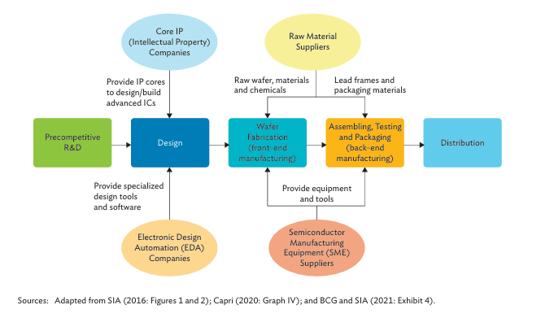
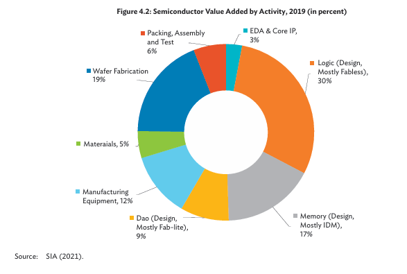
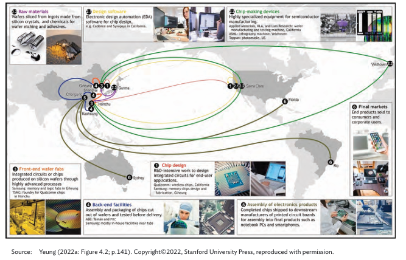

## 1.5 Introduction to the Semiconductor Ecosystem
This section provides a bird's eye view into the global value chain of the Semiconductor industry and the role of different players accross the world. 

  

 

The below diagram illustrates the main activities of the semiconductor value chain. 

  
  
<em>Figure: Basic structure of Semiconductor value chain</em>

- **Precompetitive R & D** - R&D in IC design primarily comes from Academia and research units of major design companies. This knowledge generation is distributed accross the world, but however, most of it comes from the United states. 

- **Design** - Design stage is the largest segment of the semiconductor value chain which accounts for ~56% of the entire value chain while also employing a majority of the Electronic Engineers. United States is by far the global leader in chip design, with a commanding 68% market share in the fabless segment by 2021. Most of the companies involved in designing comes under the category of fabless companies, meaning they do not manufacture their circuits, but instead outsource it to large scale fabs. One exception to this is Intel, which carries out their chip manufacturing also in-house. Some known examples of fabless companies are AMD, Nvidia, Broadcom, Qualcomm, IBM, Meta, Alphabet, Marvell, Cisco, Microsoft, MIPS, Huawei etc. 

- **Core IP (Intellectual Property)** - UK-based ARM tops this list with a 40% market share in 2020, along with American EDA providers Synopsys (20%) and Cadence (6%). 

- **Electronic Design Automation (EDA)** - US-based firms – Cadence, Synopsys, and Mentor (acquired by Siemens in 2017) dominate the entire EDA market, taking a total of 75% of the market share in 2021. It is these tools that we use to design our analog and digital circuits. 

- **Wafer Fabrication** - This stage is also called front-end manufacturing. This step is centered around a couple of large fabrication companies who handles the manufacturing of the designs coming from all around the world. Taiwanese manufacturing giant TSMC currently is the largest player in the market with a revenue-based market share of 62% followed by South Korean company Samsung with a market share of 11%. GlobalFoundries and UMC each accountes for 7%. TSMC, Samsung, and Intel – are building bleeding-edge fabs and investing in the necessary advanced SME.

- **Semiconductor Manufacturing Equipment (SME)** - 5 top SME suppliers that account for more than 70% of the market share - Applied Materials (largest), Lam Research, and KLA (smallest) from the US, ASML from the Netherlands, and Tokyo Electron from Japan. Eventhough the wafer fabrication is handled by a few major companies, the advance equipment they use for chip manufacturing comes from a completely different set of companies located in several major economies. These equipment are made for very high precision and are highly expensive. For example, ASML's latest High-NA EUV (13.5nm wavelength) chipmaking machine, the Twinscan EXE, costs around $380 million per unit.

- **Raw Materials** - Japan is the most significant country supplier of semiconductor materials and chemicals, taking a 24% market share in the global market, followed by the US at 19%. 

- **Assembly, Testing & Packaging (ATP)** - This is also called back-end manufacturing. Most ATP activities take place in Southeast Asia with Chinese Taipei accounting for 53% (by 2019) and PRC taking more than 20% of the market share. 

Logic chips (30% of semiconductor value added), memory chips (17%), and DAO chips (9%). This is followed, in terms of share in value-added, by wafer fabrication (19%) and manufacturing equipment (12%). The value-added of APT (6%), materials (5%), and EDA and core IP (3%)

  
  
<em>Figure: Semiconductor Value added by activity</em>

The diagram below shows the complete route a single chip goes from design to manufacturing to packaging to the final end user. 

  
  
<em>Figure: Semiconductor Global Production Network</em>

## References

1. [From fabless to fabs everywhere - Semiconductor Global value chains in transition](https://www.researchgate.net/publication/377598805_From_Fabless_to_Fabs_Everywhere_Semiconductor_Global_Value_Chains_in_Transition)
