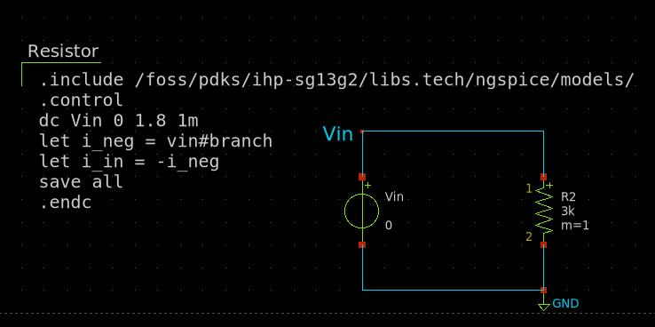
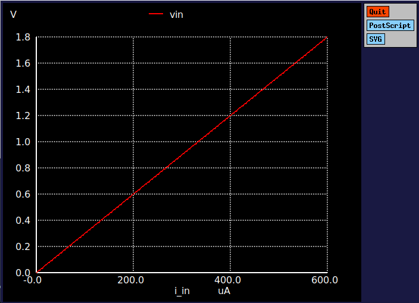
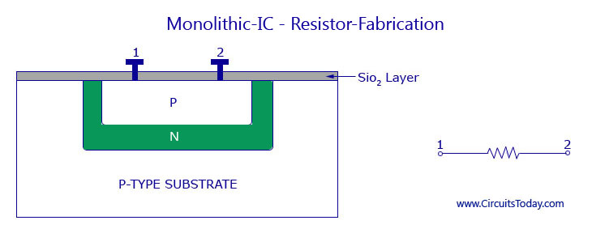

# 2.1 Resistor
A resistor is a two-terminal passive electronic component that resists the flow of electric current. Simply put, it limits how much current can pass through a circuit. It’s one of the fundamental building blocks in electronics.

The following circuit shows a resistor connected to a voltage source. The xschem simulation file can be found [here](./simulation_files/xschem/01_Resistor_DC_sweep.sch)
<figure>
  
  <figcaption><em>Figure 2.1.1: Simple circuit of a resistor.</em></figcaption>
</figure>

## Characteristics
Resistor behavior is governed by Ohm’s Law, which states:

$$V=IR$$

 
Where:

- $$V$$ is the voltage across the resistor,
- $$I$$ is the current through the resistor,
- $$R$$ is the resistance in ohms ($$Ω$$).

### Characteristics curve
The ideal resistor has a linear V-I characteristic, meaning voltage and current are directly proportional. When plotted on a graph:
<figure>
  
  <figcaption><em>Figure 2.1.2: V-I characteristics of a resistor.</em></figcaption>
</figure>

## Resistance

Resistance ($$R$$) can be modeled by the mathamatical equation,

$$
R = \frac{\rho A}{L}
$$

where:

- $$R$$ is the resistance in ohms (Ω),
- $$ \rho $$ is the resistivity of the material in ohm-meters (Ω·m),
- $$L$$ is the length of the conductor in meters (m),
- $$A$$ is the cross-sectional area of the conductor in square meters (m²).

In manufacturing process this equation is the fundemental model to make a resistor.

## IC level Implimentation
At the integrated circuit (IC) level, resistors are implemented directly on the silicon chip using materials such as polysilicon or diffused regions within the silicon wafer. These resistive elements are carefully structured as thin, straight lines or serpentine (zig-zag) shapes to control the resistance value while fitting into a compact area. The fabrication of these resistors is done using standard CMOS (Complementary Metal-Oxide-Semiconductor) processes, which often overlap with the steps used for creating transistors.

<figure>
  
  <figcaption><em>Figure 2.1.3: IC level Implementation of a resistor.
  
  [https://www.circuitstoday.com/monolithic-ic](https://www.circuitstoday.com/monolithic-ic)</em></figcaption>
</figure>