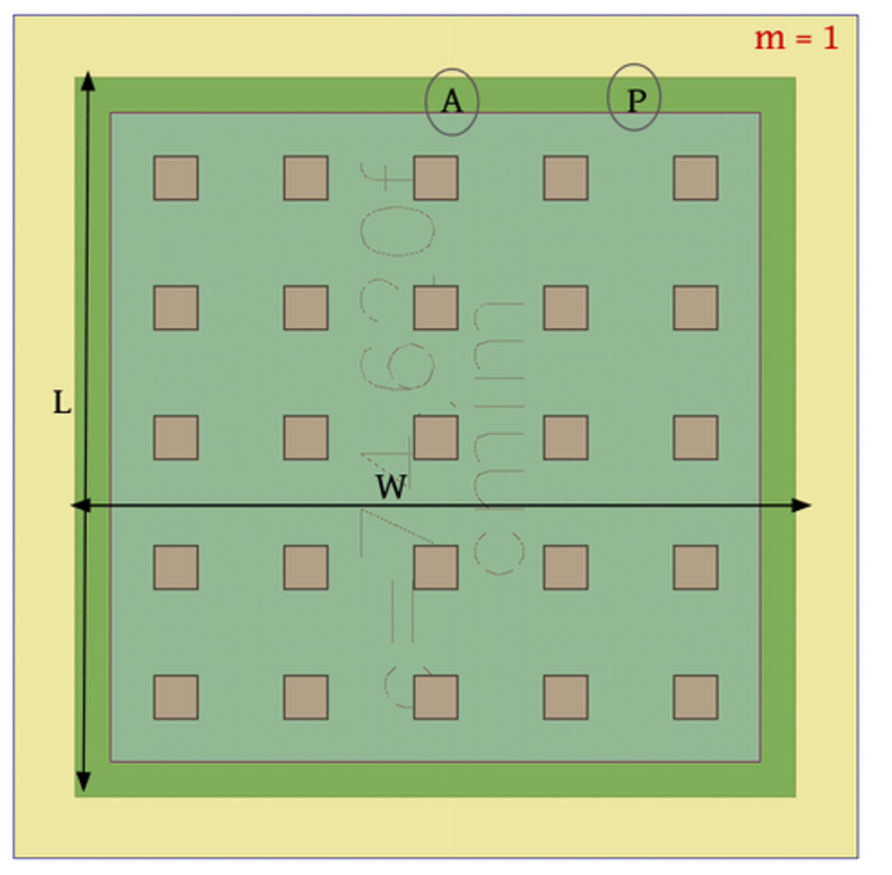

# 2.2 Capacitor
A capacitor is a two-terminal passive electronic component that stores electrical energy in an electric field. It resists changes in voltage by accumulating or releasing charge. Capacitors are essential in analog and digital circuits for filtering, coupling, decoupling, and timing applications.

The following circuit shows a capacitor connected to a voltage source. The xschem simulation file can be found [here](./simulation_files/xschem/02_Capasitor.sch)  

<figure>
  
  <figcaption><em>Figure 2.2.1: Simple RC charging circuit.</em></figcaption>
</figure>

## Characteristics
The relationship governing a capacitor is:

$$
I = C \frac{dV(t)}{dt}
$$

Where:
- $$I$$ is the current through the capacitor,
- $$C$$ is the capacitance in farads (F),
- $$\frac{dV(t)}{dt}$$ is the rate of change of voltage across the capacitor.

### Charge and Discharge Behavior
When a voltage is applied across a capacitor, it charges exponentially. During discharge, the voltage decays exponentially. This time-dependent behavior is crucial in timing and filtering circuits.

<figure>
  
  <figcaption><em>Figure 2.2.2: Voltage vs. time during capacitor charging and Discharging.</em></figcaption>
</figure>

## IC level Implementation
At the integrated circuit (IC) level, capacitors are implemented using various structural techniques depending on the required capacitance, chip area, and fabrication technology. Common types include:

- **MOS capacitors** – formed using the gate oxide of a MOS transistor structure. These are widely used for small-value capacitors in CMOS processes.
- **Metal-insulator-metal (MIM) capacitors** – built between two metal layers separated by a dielectric. MIM capacitors provide higher accuracy and are preferred in analog and RF designs.
- **Poly-poly capacitors** – made between two layers of poly-silicon with an insulating oxide in between.

The capacitor's value is determined by the area of overlap and the thickness/dielectric constant of the insulator. IC capacitors are precisely controlled during fabrication for reliable circuit behavior.

$$
C = \frac{\varepsilon A}{d}
$$

where  
$$C$$ is the capacitance,  
$$\varepsilon$$ is the permittivity,  
$$A$$ is the area of the plates, and  
$$d$$ is the distance between the plates.

<figure>
  
  <figcaption><em>Figure 2.2.3: IC level implementation of a capacitor.
  
  [https://www.circuitstoday.com/monolithic-ic]</em></figcaption>
</figure>

### Capasitor Layout

<figure>
  
  <figcaption><em>Figure 2.2.4: IC level layout of a resistor.
  
  [https://ihp-open-pdk-docs.readthedocs.io/en/latest/]</em></figcaption>
</figure>

$$
C=C_{ox}.L.W
$$

$$C_{ox}$$ is the capacitance of the unit block.

The following image shows scanned image of a manufactured capacitor cross-section view.

<figure>
  
  <figcaption><em>Figure 2.1.5: scanned cross section view of a capacitor.
  </em></figcaption>
</figure>