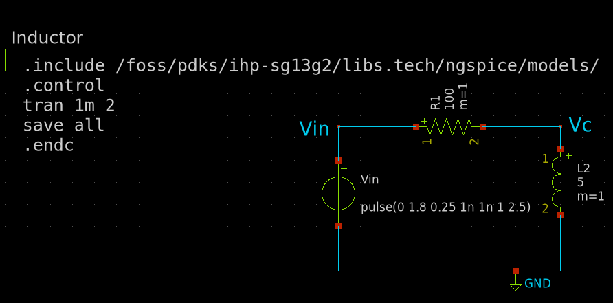
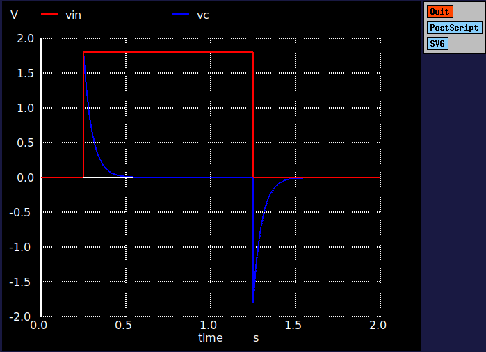

# 2.3 Inductor

An inductor is a two-terminal passive electronic component that stores energy in a magnetic field when current flows through it. It resists changes in current, which makes it a crucial element in circuits involving alternating current (AC) or in applications like filtering, energy storage, and inductive coupling.

The following circuit shows an inductor connected to a voltage source. The xschem simulation file can be found [here](./simulation_files/xschem/03_Inductor.sch).
<figure>
  
  <figcaption><em>Figure 2.2.1: Simple circuit of an inductor.</em></figcaption>
</figure>

## Characteristics
The behavior of an inductor is governed by Faraday’s Law of Induction, which states:

$$V = L \frac{dI}{dt}$$

where:

- $$V$$ is the voltage across the inductor,
- $$L$$ is the inductance in henries (H),
- $$\frac{dI}{dt}$$ is the rate of change of current through the inductor.

### Characteristics curve
An ideal inductor’s V-I characteristic is not linear, as it depends on the time rate of change of current. 

The following plot shows the charging and discharging curves of an inductor

<figure>
  
  <figcaption><em>Figure 2.2.2:Charging and Discharging curves of an inductor.</em></figcaption>
</figure>

## IC level Implementation
At the integrated circuit (IC) level, inductors are more challenging to implement due to their requirement for a magnetic field, which is hard to produce in a small-scale, silicon-based environment. Typically, inductors in ICs are realized using metal traces formed into coils or spiral shapes on the silicon wafer. The inductance value is determined by factors such as the number of turns in the coil, the area of the coil, and the spacing between turns.

In CMOS processes, these inductors are often integrated in radio-frequency (RF) circuits or power management systems. The inductor’s design must account for parasitic capacitances, resistances, and the self-resonant frequency, which can impact its performance. Fabrication techniques aim to balance compactness with inductive behavior, often using advanced processes or post-CMOS techniques to create large inductance values in small f