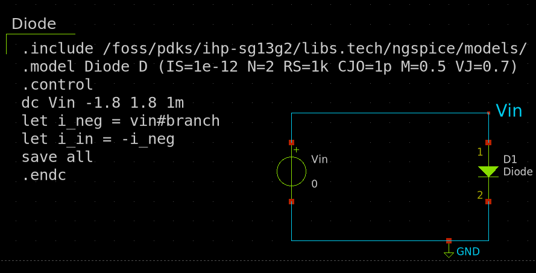
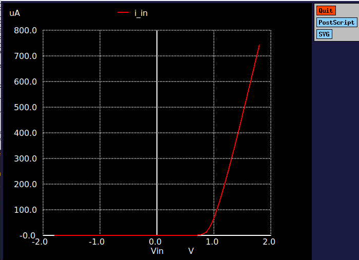
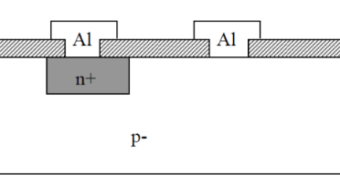

# 2.4 Diode

A diode is a two-terminal electronic component that allows current to flow in one direction only, blocking current in the opposite direction. This unidirectional behavior is a key feature in many electronic circuits, especially in rectification, voltage regulation, and signal processing applications.

The following circuit shows a diode connected to a voltage source. The xschem simulation file can be found [here](./simulation_files/xschem/04_Diode.sch).
<figure>
  
  <figcaption><em>Figure 2.3.1: Simple circuit of a diode.</em></figcaption>
</figure>

## Characteristics
A diode’s behavior is governed by the Shockley diode equation:

$$
I = I_0 (e^{\frac{V_D}{nV_T}} - 1)
$$

where:

- $I$ is the current through the diode,
- $V_D$ is the voltage across the diode,
- $I_0$ is the reverse saturation current,
- $n$ is the ideality factor (typically between 1 and 2),
- $V_T$ is the thermal voltage (approximately 26 mV at room temperature).

### Characteristics curve
The diode exhibits a non-linear V-I characteristic. It behaves as an open circuit for reverse bias (blocking current) and as a low-resistance path for forward bias (allowing current to flow). The current increases exponentially with the forward voltage:
<figure>
  
  <figcaption><em>Figure 2.3.2: V-I characteristics of a diode.</em></figcaption>
</figure>

## IC level Implementation
At the integrated circuit (IC) level, diodes are typically fabricated using the same processes as transistors, but they are designed to have a p-n junction with the appropriate doping concentrations. The p-n junction is formed by diffusing p-type material into n-type silicon or vice versa. These diodes are widely used for tasks such as rectification, voltage clamping, and signal mixing in ICs.

In CMOS processes, diodes are often used for protection (clamping) and signal modulation, as well as in more complex circuits such as diodes for voltage regulation (e.g., Zener diodes). The physical layout of a diode is similar to a transistor in that both rely on the p-n junction for their operation. 

<figure>
  
  <figcaption><em>Figure 2.3.3: IC level implementation of a diode.</em></figcaption>
</figure>