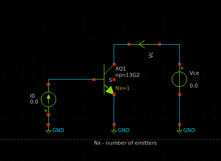
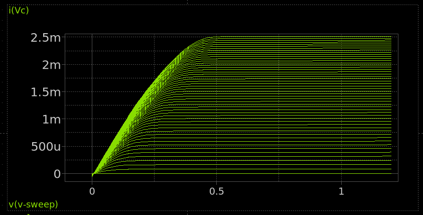
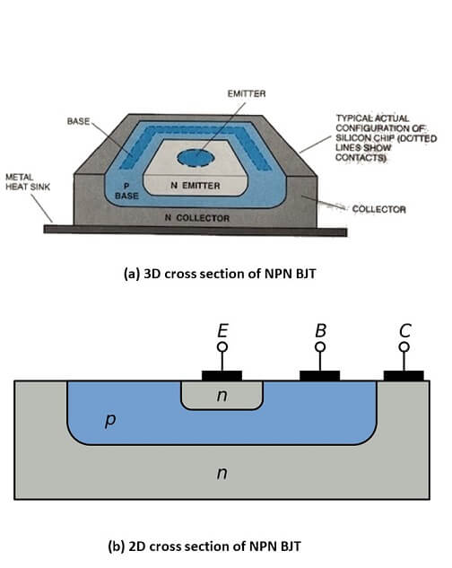

# 2.5 The Bipolar Junction Transistor (BJT)

A Bipolar Junction Transistor (BJT) is a three-terminal active semiconductor device used to amplify or switch electronic signals. It consists of two p-n junctions configured in either NPN or PNP formation. Current flowing into one terminal (the base) controls the current flowing between the other two terminals (collector and emitter), making it a current-controlled device.

The following circuit shows a BJT in a common-emitter configuration. The xschem simulation file can be found [here](./simulation_files/xschem/04_BJT_DC_sweep.sch).
<figure>
  
  <figcaption><em>Figure 2.4.1: Simple BJT amplifier circuit.</em></figcaption>
</figure>

## Characteristics
BJT operation is governed by the relationship between the base-emitter and collector-emitter voltages. In the active region, the collector current $I_C$ is given by:

$I_C = \beta I_B$

where:

- $I_C$ is the collector current,
- $I_B$ is the base current,
- $\beta$ (or $h_{FE}$) is the DC current gain of the transistor.

BJTs have three operating regions:

- **Cut-off**: Both junctions reverse biased → transistor OFF  
- **Active**: Base-emitter forward biased, base-collector reverse biased → transistor amplifies  
- **Saturation**: Both junctions forward biased → transistor ON (switching)

### Characteristics curve
The output characteristics of a BJT (i.e., $I_C$ vs $V_{CE}$ for different $I_B$ values) show how the collector current varies with collector-emitter voltage:
<figure>
  
  <figcaption><em>Figure 2.4.2: BJT output characteristics ($I_C$ vs $V_{CE}$).</em></figcaption>
</figure>

## IC level Implementation
At the IC level, BJTs are commonly implemented using **bipolar processes**, such as the **BiCMOS (Bipolar CMOS)** process, which combines bipolar and CMOS devices on a single chip. In standard bipolar or BiCMOS processes, the BJT is built vertically through the silicon substrate. The vertical NPN transistor, which is more common, is constructed with:

- **Emitter**: A shallow n+ diffusion,
- **Base**: A p-type region beneath the emitter,
- **Collector**: A deep n-type region reaching into the substrate.

This vertical structure provides high current density and better performance at high frequencies.

BJTs in ICs are often used for:

- Analog signal amplification,
- Bandgap references,
- High-speed digital drivers,
- Temperature sensors.

Although CMOS has largely replaced BJTs in most digital logic, BJTs remain essential in analog and mixed-signal IC design where precision and speed are critical.

<figure>
  
  <figcaption><em>Figure 2.4.3: IC level implementation of a BJT (cross-sectional view).</em></figcaption>
</figure>
