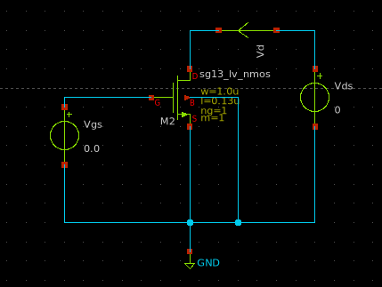
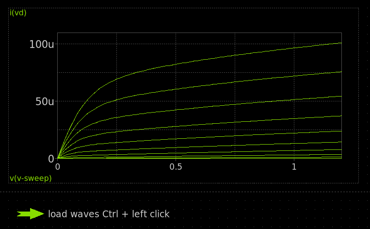
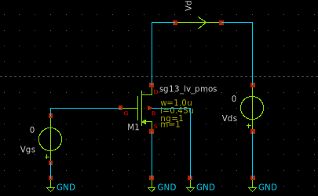
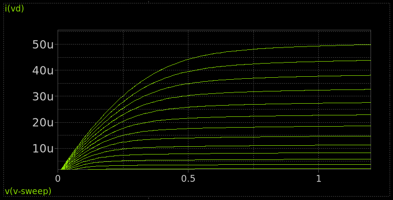

# 2.6 The Metal-Oxide-Semiconductor Field-Effect-Transistor (MOSFET)

A Metal-Oxide-Semiconductor Field-Effect Transistor (MOSFET) is a voltage-controlled, four-terminal semiconductor device used to amplify or switch electronic signals. It is the fundamental building block of modern digital and analog integrated circuits. MOSFETs come in two major types: NMOS (n-type) and PMOS (p-type).

## Characteristics

MOSFET operation is controlled by the voltage applied between the gate and source terminals. For an NMOS device, current flows from drain to source when the gate voltage exceeds a certain threshold voltage ($V_{TH}$). The current-voltage characteristics can be described by:

- **Cut-off Region** : MOSFET is OFF.
$$
V_{GS} < V_{TH}
$$
- **Triode (Linear) Region** ($V_{GS} > V_{TH}$ and $V_{DS} < V_{GS} - V_{TH}$):

$$
I_D = \mu_n C_{ox} \frac{W}{L}[(V_{GS} - V_{TH})V_{DS} - \frac{V_{DS}^2}{2}]
$$
- **Saturation Region** ($V_{GS} > V_{TH}$ and $V_{DS} \ge V_{GS} - V_{TH}$):

$$
I_D = \frac{1}{2}\mu_n C_{ox} \frac{W}{L}(V_{GS} - V_{TH})^2
$$

where:

- $I_D$ is the drain current,
- $V_{GS}$ is gate-source voltage,
- $V_{DS}$ is drain-source voltage,
- $k = \mu_n C_{ox} \frac{W}{L}$ is a device-specific constant,
- $W$ and $L$ are the transistor’s width and length.

## Channel Width (W) and Length (L)

At the IC level, the **channel width (W)** and **channel length (L)** of a MOSFET are critical design parameters that directly affect the transistor’s behavior and performance. These dimensions define the size of the channel through which carriers (electrons or holes) flow when the device is on.

<figure>
  
  <figcaption><em>Figure 2.5.5.1: MOSFET cross-section showing W and L.</em></figcaption>
</figure>

### Definitions:
- **W (Width)**: The dimension of the MOSFET channel **perpendicular** to current flow. A wider channel allows more current.
- **L (Length)**: The dimension of the MOSFET channel **along** the direction of current flow (distance between source and drain). A shorter length improves speed but increases leakage and short-channel effects.

### Drain Current Equation (in saturation region):
The drain current $I_D$ for an ideal MOSFET in saturation is given by:

$$
I_D = \dfrac{1}{2} \mu C_{ox} \dfrac{W}{L} (V_{GS} - V_{TH})^2
$$

Where:
- $\mu$ = Carrier mobility (electrons for NMOS, holes for PMOS),
- $C_{ox}$ = Gate oxide capacitance per unit area,
- $W$ = Channel width,
- $L$ = Channel length,
- $V_{GS}$ = Gate-Source voltage,
- $V_{TH}$ = Threshold voltage.

### Impact of W and L:
| Parameter Change | Effect on $I_D$ | Effect on Speed | Power Impact |
|------------------|------------------|------------------|---------------|
| Increase **W**   | Increases         | Faster drive     | Higher dynamic power |
| Increase **L**   | Decreases         | Slower           | Reduced leakage |
| Decrease **L**   | Increases (shorter path) | Faster switching | Higher leakage |

In digital ICs, **minimum L** is chosen to maximize speed, while **W** is adjusted to set the drive strength and balance rise/fall times in CMOS logic gates.

---

## NMOS Transistor

### Working Principle
In an NMOS transistor, a **positive gate voltage** attracts electrons towards the channel, forming a conductive n-type path between the source and drain in a p-type substrate. When $V_{GS} > V_{TH}$ (threshold voltage), the transistor turns ON, allowing current from drain to source.

### Circuit Example
The following schematic shows an NMOS in a common-source configuration:
<figure>
  
  <figcaption><em>Figure 2.5.1.1: Simple NMOS amplifier circuit.</em></figcaption>
</figure>

### Output Characteristics
The output characteristics ($I_D$ vs $V_{DS}$ for different $V_{GS}$ values) show distinct regions:

- **Cut-off**: $V_{GS} < V_{TH}$ → Transistor OFF
- **Triode**: $V_{DS} < V_{GS} - V_{TH}$
- **Saturation**: $V_{DS} \ge V_{GS} - V_{TH}$

<figure>
  
  <figcaption><em>Figure 2.5.1.2: NMOS output characteristics.</em></figcaption>
</figure>

### IC-Level Implementation
In ICs, NMOS is fabricated on a **p-type substrate**, with heavily doped **n+** regions for the source and drain, and a **polysilicon gate** over a thin gate oxide. NMOS devices are typically faster than PMOS due to higher electron mobility.

---

## 2.5.2 PMOS Transistor

### Working Principle
A PMOS transistor operates in the opposite way: a **negative gate voltage** repels electrons and attracts holes to form a conductive p-type channel in an **n-type well**. The transistor turns ON when $V_{SG} > V_{TH}$ (gate is more negative than source).

### Circuit Example
The schematic below shows a PMOS transistor in a similar configuration:
<figure>
  
  <figcaption><em>Figure 2.5.2.1: Simple PMOS amplifier circuit.</em></figcaption>
</figure>

### Output Characteristics
Similar to NMOS but with reversed voltages and current direction:

- **Cut-off**: $V_{SG} < V_{TH}$ → Transistor OFF  
- **Triode**: $V_{SD} < V_{SG} - V_{TH}$  
- **Saturation**: $V_{SD} \ge V_{SG} - V_{TH}$  

<figure>
  
  <figcaption><em>Figure 2.5.2.2: PMOS output characteristics.</em></figcaption>
</figure>

### IC-Level Implementation
In CMOS processes, PMOS transistors are fabricated inside an **n-well**. Source and drain are **p+** regions. PMOS devices are typically slower than NMOS due to lower hole mobility, requiring wider channel widths for similar drive strength.

---

## 2.5.3 NMOS vs PMOS Comparison

| Feature              | NMOS                        | PMOS                        |
|----------------------|-----------------------------|-----------------------------|
| Channel type         | n-type (electrons)          | p-type (holes)              |
| Substrate            | p-type                      | n-well                      |
| Conduction when      | $V_{GS} > V_{TH}$           | $V_{SG} > V_{TH}$           |
| Carrier mobility     | Higher (electrons)          | Lower (holes)               |
| Speed                | Faster                      | Slower                      |
| Area (for same drive)| Smaller                     | Larger                      |
| Symbol direction     | Arrow *out* of source       | Arrow *into* source         |

---