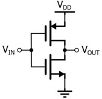
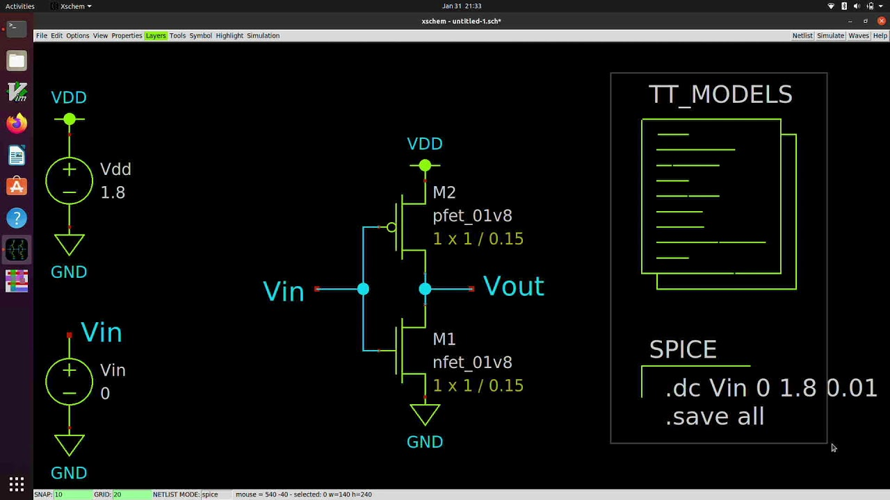
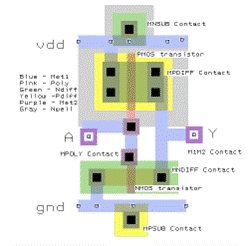
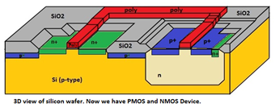
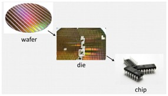
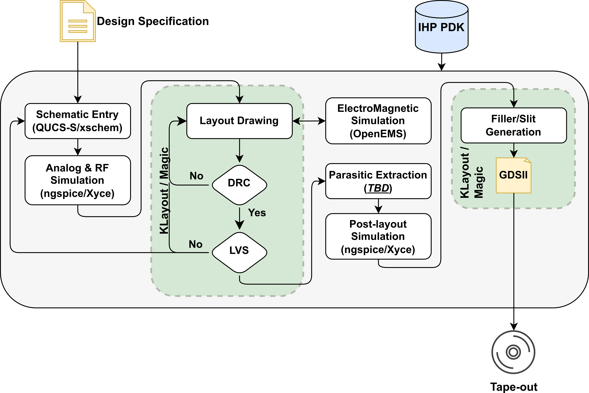

{: .no_toc }

# 3.1 Analog IC Design Flow
{: .no_toc }

  

    Table of contents
  

  {: .text-delta }
- TOC
{:toc}

Let’s get an idea of the big picture of analog IC design using CMOS inverter design. This will help you get a clear idea from upcoming sessions.

## 3.1.1 The CMOS Inverter
We have discussed what is a CMOS inverter in last section and simply it is a basic digital logic gate that reverses the state of an input signal.
> Why an Inverter?
>
> Inverter is one of the simplest yet most fundamental concepts in electronics. It is like “Hello world” in analog IC designing. It's used everywhere, from processors to memory systems.

Before we can create a silicon-based inverter, we think you have a basic understanding of inverter design in terms of physical components. This typically consists of two transistors:

- P-channel MOSFET(PMOS) : Conducts when the input is low 
- N-channel MOSFET(NMOS) : Conducts when the input is high
    
These two transistors work together to create the inverter function, where:

- When the input is high, the NMOS conducts, pulling the output to low.
- When the input is low, the PMOS conducts, pulling the output to high.

**Schematic of inverter**

  <table>
    <tr>
      <td>
        
      </td>
      <td>
        
      </td>
    </tr>
  </table>
  
<em>Figure: CMOS Inverter Schematic</em>

**Layout design**

Have you ever thought how do these schematics are implemented in a silicon wafer?  Let’s now discuss the process of translating this designed schematic into a physical layout that can be actually implement in silicon wafer. 
This process is done using layout tools like Cadence, Magic or Klayout. Magic and Klayout will be used over this course and they are freely accessible from opensource community. The layout specifies where each transistor and connection will physically reside on the silicon chip. The layout involves placement and routing steps. 

  
  
<em>Figure: Inverter layout design in Klayout</em>

**Fabrication** 

Once the layout is finalized, it is sent to a foundry for fabrication. This is where the design comes to life. In the fabrication process, the layouted design is translated onto a silicon wafer using a series of technically heavy and complex steps. You can get a full idea on fabrication process by referring to these(link to cmos process part)  

  
  
<em>Figure: Side view of NMOS and PMOS</em>

**Testing and Packaging**

Once the chip has been fabricated, it's tested to make sure it works as intended and then the chip is packaged. The chip is cut into dies, and then Pins are attached to the die to allow it to be connected to external components in a system

  
  
<em>Figure: IC from wafer to package</em>

Now you will have a small IC that you can use as an over-the-shelf device. Remember that this process seems very simple here, but it takes lot of resources and time to manufacture a chip in silicon level and here you got a very basic idea about this process you may get the chance to learn and experience the very detailed whole process throughout this course.

To get a full idea about the design process of a CMOS inverter, please visit the [Inverter Design](https://skillsurf.github.io/art_of_aicd/content/05-inverter-design.html).

## 3.1.2 Analog IC Design Flow Steps

Here the below diagram summarizes the analog design flow we are going to folow through this programme. This is the basic design flow for even more complex designs.

  
  
<em>Figure: Analog IC Design Flow Diagram</em>

**Schematic Entry**

This involves the creation of the circuit schematic. Tools like **QUCS** or **Xschem** are typically used, which function similarly to **LTSpice**.  
These tools generate a **netlist**, which is the foundation for subsequent simulations and layout steps.
> **What is a netlist?**
> 
> A netlist is a hierarchical data structure that comprehensively details the interconnections and relationships between electronic components, including gates, transistors, flip-flops, and other logic elements, within an integrated circuit design. It essentially represents the connectivity among these components without specifying their physical layout.

**Analog & RF Simulation**

This is the next step where the designed schematic is simulated to check for its functionality to gain an understanding whether it achieved the expected outcome.
**ngspice** and **Xyce** are simulation tools used to analyze the behavior of analog and RF circuits and further more these simulators allow for simulate some overtime variations of the IC also.

**Layout Drawing**

Here the schematic is translated into a physical design that can be implemented on a silicon wafor, specifying where each component will be placed on the chip and how should they connected to each other. 
This is created using tools like **KLayout** or **Magic**. This kind of map navigates the CMOS components **geometry, size, and placement** of each to the silicon wafer.

**Design Rule Check (DRC)**

This ensures that the layout meets the design rules required for successful fabrication.
Check and verifies properties like Spacing, Layer Widths and Alignment etc.  This is based on the fabrication process that we’re using. Each fabricator will supply their own rule set for the PDK.  

> Think of this like checking PCB trace spacing – if they’re too close, it can’t be fabricated reliably. 

**Layout vs. Schematic (LVS)**

This check verifies that the **physical layout** is an accurate representation of the **original schematic**.  
It confirms that all devices and connections match without omissions or additions.

**Electromagnetic Simulation**

Tools like **OpenEMS** are used to evaluate the **electromagnetic field behavior** of the layout.  
This is critical for **RF designs** to ensure signal integrity and to detect undesired coupling or radiation.

**Parasitic Extraction**

Parasitic effects such as **unintended resistances, capacitances, and inductances** are extracted from the layout.  
These effects can degrade performance and must be accounted for in final simulations. This test identifies unwanted parasitic components in the layout. There are several reasons for generations of the parasitic effects and this helps to estimates how these parasitic will affect circuit performance.

**Post-Layout Simulation**

This is the final simulation step, where the layout, including parasitic effects, is simulated. This ensures that the final design, including all parasitic elements, still meets the desired specifications.

**GDSII Generation**

The design is exported to **GDSII format**, which is the industry standard for fabrication.  
This file includes the complete layout data (metal layers, vias, geometry) required by the **foundry** to manufacture the chip.

