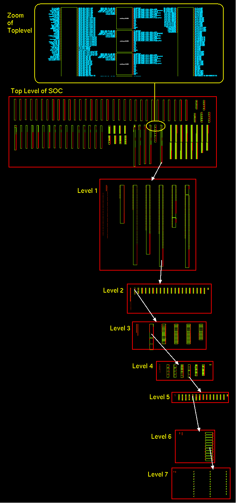
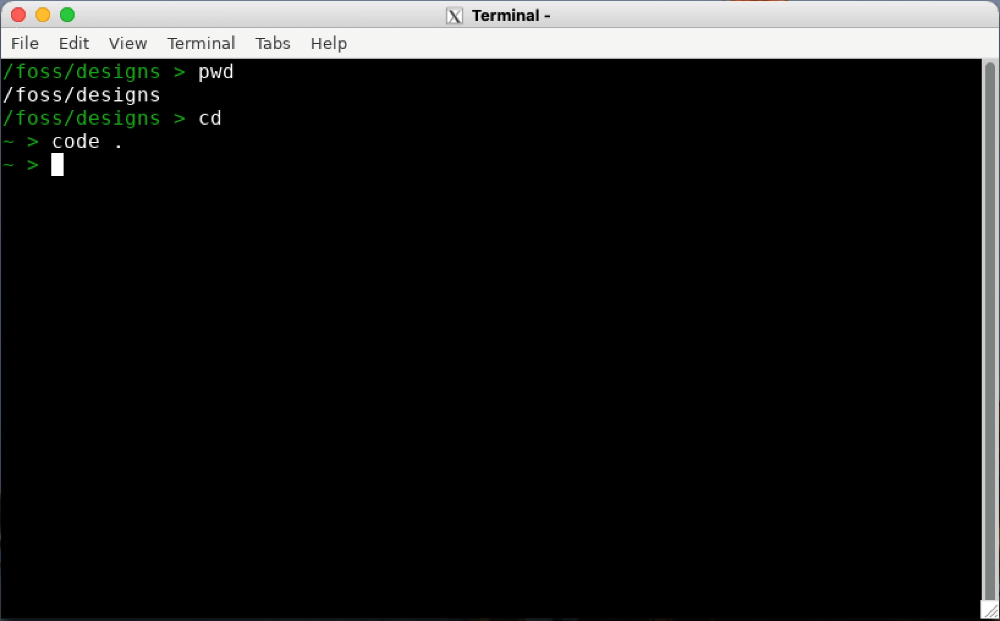

{: .no_toc }
# 3.2 What are OSIC tools?

{: .no_toc }

<details open markdown="block">
  <summary>
    Table of contents
  </summary>
  {: .text-delta }
- TOC
{:toc}
</details>

**Open-Source Integrated Circuit tools (OSIC)** are a collection of free and open-source software applications used for the design, simulation, layout, and verification of integrated circuits. They aim to provide an open, accessible alternative to expensive commercial Electronic Design Automation tools like Cadence and Virtuoso, traditionally used in the semiconductor industry.

> **Note:** In this course, we will follow the pre-compiled Docker image named  **IIC-OSIC-TOOLS** based method which allows for circuit design on a virtual machine on virtually any type of computing equipment.

## 3.2.1 Xschem

### 1. Schematic Design in the Design Cycle
In electronic product development, the first step is typically drawing the circuit diagram using an interactive computer program called a schematic editor. Once the schematic is completed, the circuit connectivity and device list (this is collectively called as the **netlist**) can be generated. This netlist is then used by a circuit simulator such as **NGSPICE** to perform simulations and verify the circuit functionality before moving to fabrication.

### 2. Overview of XSCHEM

**XSCHEM** is a powerful and user-friendly **schematic capture tool** designed primarily for **VLSI** (Very Large Scale Integration) circuit design. It allows designers to **interactively enter an electronic circuit** using a graphical interface and **generate netlists** for various simulation and design tools.

**Key Features of XSCHEM:**
- **Interactive schematic entry** 
- **Efficient handling of large and hierarchical designs** (up to many levels 10+ levels deep).
- **Support for multiple netlist formats**.
- **Optimized rendering and netlisting engines** to manage large-scale System-on-Chip (SoC) designs efficiently.

These features made xschem a suitable software in the open-source analog IC design path. Further its interactive yet very simple user interface for schematic designs, symbol allocation, parametric handling, and behavioral mode support-like features made it unique.

**Example: Large Hierarchical Design in XSCHEM**
Below is an image showing a VLSI System-on-Chip (SoC) design imported into XSCHEM. This demonstrates XSCHEM’s capability to handle very large designs with **deep hierarchies** and **complex structures**.
<div align="center">
  
  <p><em>Figure: Complex SOC design in xschem</em></p>
</div>

> **Note:** While initially intended for IC design, XSCHEM has recently expanded to support PCB workflows through the **tEDAx** format.

### 3. Install xschem
In this course, instead of installing xschem separately from github repository we will follow the Docker-based method. If you have done the installation correctly, you can open the Xschem software by simply typing ```xschem```in the terminal after you run the docker image.
<div align="center">
  
  <p><em>Figure: Xschem opening window with Skywater 130 and IHP PDKs</em></p>
</div>

### 4. Design a  schematic
Xschem provides different elements like symbols, wires, text, polygons, etc. for schematic designing. ths can be insert by just using **Shift + I**. The symbols used in the design process will depend on the PDK. 

### 5. Netlist Formats Supported by XSCHEM

XSCHEM currently supports three netlist formats:

| Netlist Format  | Purpose |
|-----------------|---------|
| **SPICE**       | For analog and mixed-signal circuit simulation. |
| **VHDL**        | For digital simulation and synthesis workflows. |
| **VERILOG**     | For digital simulation and hardware description. |

For future reference: 
- **How to Set Netlist Mode:**
  - Use the **Options menu** and select between modes.
  - Alternatively, press **Shift + V** to cycle through modes.

- **How to Generate Netlist:**
  - Press the **Netlist** button located at the top-right of the menu bar after the schematic is designed.
  - Or simply press the **n** key.

- The netlist file will be created in the defined simulation directory, ready for use with simulators or downstream tools.
  
add a pic og netlist of inverter

## 3.2.2 Ngspice
Ngspice is an open-source spice simulator for electric and electronic circuits. It is used for analog, digital, and mixed-signal simulations. Model parameters are provided by ngspice collections, by the semiconductor device manufacturers, or from semiconductor foundries. The user can add circuits as a netlist, and the output is one or more graphs of currents, voltages and other electrical quantities, or it can be saved in a raw data file.

Ngspice supports:

**Verilog-A Device Models**
- We can integrate Verilog-A compact models without additional programming needed on the ngspice side.

**Mixed-Signal Co-Simulation**

**User-Defined Models**
- Custom devices can be created using behavioral sources. This allows defining new analog, mixed, or digital models.

**Programming Ngspice**
- Internal scripting language supports control flows and mathematical operations.

**Circuit Optimization**
- Optimization methods include scripting, Tclspice, and differential evolution algorithms (e.g., ASCO optimizer).

**Statistical Circuit Analysis**
- Supports Monte Carlo simulation with random functions.
- Noise sources like thermal, 1/f, and RTS noise available for transient simulations.

**RF Analysis**
- Transmission line modeling, S-parameter extraction, and FFT analysis.

**TCAD Integration**
- Device simulations from TCAD tools can be integrated into ngspice circuit simulations.


### 1. Install NGSPICE

Included in the IIC-OSIC-TOOLS Docker image.

### 2. Running a Basic Simulation

First we have to create a netlist describing this circuit using Xschem. The netlist is the input to ngspice, telling it about the circuit to be simulated. With some simulation commands, this input cares for reading and parsing the netlist, starting the simulation, and plotting the output. Below is the basic simulation for a CMOS inverter.

pic

Here is another basic example for Ngspice designs. These figures summarize the design process of a passive low-pass filter on Ngspice.

pic and netlsit and spice code


### 3. Types of Analysis

**i.DC Analysis (Operating Point and DC Sweep)** :Operating Points Calculates steady-state node voltages and branch currents and DC Sweep, Varies a DC source over a range to observe the circuit response.

General form:
```
.dc srcnam vstart vstop vincr [src2 start2 stop2 incr2] 
```
Examples:
```
.dc VIN 0.25 5.0 0.25
.dc VDS 0 10 .5 VGS 0 5 1
.dc VCE 0 10 .25 IB 0 10u 1u
.dc RLoad 1k 2k 100
.dc TEMP -15 75 5 
```

**ii.AC Small-Signal Analysis** :Evaluates the frequency response of the circuit using small AC input signals.

Example: (Basic RC circuit)
```
r 1 2 1.0
c 2 0 1.0
vin 1 0 dc 0 ac 1 $ <--- the ac source
.options noacct
.ac dec 10 .01 10
.plot ac vdb(2) xlog
.end
```
**iii.Transient Analysis** :Simulates time-domain behavior of the circuit when inputs change with time.

General form:
```
.tran tstep tstop <tstart <tmax>> <uic>
```
Examples:
```
.tran 1ns 100ns
.tran 1ns 1000ns 500ns
.tran 10ns 1us
```
**iv.Pole-Zero Analysis** :Finds the poles and zeros of a circuit’s transfer function for frequency and stability insights.
General form:
```
.pz node1 node2 node3 node4 cur pol
.pz node1 node2 node3 node4 cur zer
.pz node1 node2 node3 node4 cur pz
```
**v.Small-Signal Distortion Analysis** :Measures how much harmonic distortion is introduced by the circuit for small inputs.
General form:
```
.noise v(output <,ref>) src ( dec | lin | oct ) pts fstart fstop
+ <pts_per_summary>
```
Examples:
```
.noise v(5) VIN dec 10 1kHz 100MEG
.noise v(5,3) V1 oct 8 1.0 1.0e6 1
```


## 3.2.3 netgen

**Netgen** is a tool used for **Layout vs. Schematic (LVS)** verification, which is a crucial step in ensuring that the final layout matches the intended circuit design. Here Netgen compare the genertaed netlists from the schematic and a netlist extracted from the layout. The layout tool such as magic and Klayout supports extracting the netlist for LVS. Netgen will compare these two files to decide if the two netlists are identical. If it is not identical, we have to identify the differences and change the layout and/or the netlist so that they are identical. The identical layout and schematic also ensures somewhat that the circuit will work as expected. 

We need to do this check because when transforming from schematic to layout, you might make different mistakes, for example, a short circuit. The connection and the terminal in the layout are different from the schematic. LVS is an important step in analog design flow to ensure that your layout is identical to your schematic.

### 1. Key Features
- Hierarchical netlist comparison
- Integration with Magic and KLayout
- Error reporting for mismatches such as:
  - Missing devices
  - Incorrect connectivity
  - Parameter mismatches

### 2. Running Netgen LVS
Running LVS with netgen is very simple, you just need to run netgen with three arguments. First open netgen using The first one and the second one are the two netlists that we created. The third argument is a configuration file that is already available from the PDK. You might have a look at ```$PDK_ROOT/$PDK/libs.tech/netgen/setup.tcl```
To run an LVS check:
```bash
netgen -batch lvs layout.spice schematic.spice ihp-sg13g2_setup.tcl
```

### 3. Sample Workflow
1. Schematic design in Xschem and get the netist.
2. Layout in Magic.
3. Extract layout netlist using Magic or Klayout.
4. Run Netgen to compare schematic and layout netlists.(both netlists sholud be in same directry where netlist is called)

LVS passed is a good sign that your schematic and your layout are equivalent. However, it might not tell you about the important characteristics in analog design. You should run the post layout spice simulation with the parasitic extraction to verify that the parasitic after layout do not affect your design very much.

## 3.2.4 OpenEMS

**OpenEMS** is an open-source electromagnetic field solver specifically designed for high-frequency RF and microwave circuit simulations. It uses the **Finite-Difference Time-Domain (FDTD)** method, which provides full-wave 3D EM analysis and supports both transient and frequency domain results.

**Applications in IC Design and RF Systems:**
- On-chip antennas
- Transmission line simulations
- Electromagnetic interference (EMI) analysis
- Substrate coupling and shielding analysis
- RFIC packaging analysis

OpenEMS is particularly useful for simulating **structures with spatial non-uniformity** or **complex geometries** that cannot be simplified into circuit models.
### 1. Install OpenEMS

Included in the IIC-OSIC-TOOLS Docker image.

### 2. Key Features of OpenEMS

-fully 3D Cartesian and cylindrical coordinates graded mesh.
-Multi-threading, SIMD (SSE) and MPI support for high speed FDTD.
-Octave/Matlab and Pyhon-Interface
-Dispersive material (Drude/Lorentz/Debye type)
-Field dumps in time and frequency domain as vtk or hdf5 file format
-Flexible post-processing routines in Octave/Matlab and Python

### 3. Workflow to Simulate with OpenEMS

You can use open EMS in python enabled CMI. make sure that open EMS and python is installed there. for more information about OpenEMS simulations please visit [here](https://docs.openems.de/python/openEMS/Tutorials/index.html#how-to-run-the-tutorials)


## 3.2.5 QUCS-S
### 1.Overview
**Qucs-S** (Quite Universal Circuit Simulator - SPICE edition) is a circuit simulation interface that unifies powerful simulation engines like **Ngspice**, **Xyce**, and **QucsatorRF** under a simple GUI built using the **Qt6 toolkit**. Unlike standalone simulators, Qucs-S is not a simulation engine itself but acts as a graphical front-end for these backends.

Its main purpose is to **merge the power of SPICE simulators** with the intuitive, schematic-based graphical interface of the original Qucs project. Simply this gives more commercelized user friendly version for open sources simulations.

> 🔗 For more deatials please visit [here](https://ra3xdh.github.io/)

### 2. Supported Simulation Backends

- **Ngspice**  
  - Recommended backend.
  - Supports mixed-level/mixed-signal simulation.
  - High compatibility with industrial SPICE models.
  - Works well with SkyWater 130nm PDK.
  - Powerful simulation performance and post-processing.

- **Xyce**  
  - Developed by Sandia National Labs.
  - SPICE-compatible.
  - Offers advanced RF simulations, including **harmonic balance analysis**.
  - Includes **XYCE digital devices library**.

- **QucsatorRF**  
  - Used primarily for **RF and microwave circuits**.
  - Supports microstrip lines and waveguides.
  - Not SPICE-compatible.
  - Can be used for general circuits but not recommended.


### 3. Key Features

- Unified GUI for multiple simulation backends.
- **Quick switching** between simulation engines without restarting.
- Direct support for SPICE models from datasheets.
- **Tuner mode** for real-time parameter adjustment.
- Support for **.PARAM** statements and **Nutmeg** postprocessor.  
- Nutmeg/XYCE script simulation support (advanced scripting mode).
- Supports digital and RF libraries for backend-specific simulation.

### 4. Supported Simulations

- **Basic Types**: DC, AC, Transient (TRAN), Parametric Sweep
- **Advanced SPICE Simulations**:
  - DISTO (Distortion Analysis)
  - NOISE
  - SENS (Sensitivity, added in v0.0.20)
  - Spectrum and FFT Analysis
  - Pole-Zero Analysis
- **Harmonic Balance Simulation** with XYCE and QucsatorRF
- **S-Parameter Simulation** using Qucsator and XYCE

This is ideal for RF and analog front-end circuit designs. This helps to simulate and validate SPICE netlists generated from tools like Xschem. Ngspice backend ensures compatibility with **IHP PDK** designs.

pic of sim

## 3.2.6 KLayout
