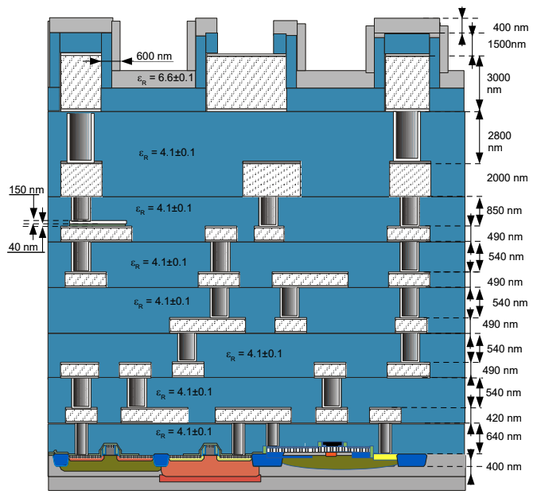

# 4.1 IHP’s SG13G2 130nm CMOS Technology

### Overview

The **SG13G2** is a high-performance **BiCMOS** technology [\[IHP\]](https://ihp-open-pdk-docs.readthedocs.io/en/latest/) featuring a **130nm CMOS process** and supports full custom analog and RF designs. It includes both **SiGe:C npn-HBT** bipolar devices with transit frequencies up to **300 GHz (fT)** and **500 GHz** maximum oscillation frequencies and CMOS transistors, though the CMOS subset (referred to as SG13C) is sufficient for most analog applications. Learn more about the [**BJT Devices**](https://ihp-open-pdk-docs.readthedocs.io/en/latest/verification/lvs/04_03_bjt.html).

{: .note-title}
> What is this 130nm process?
>
> In this context, “process” is used to describe the fabrication process rather than the computer’s processor. It’s about how the chip gets made, not what it can do. The size of the process node, measured in nanometers, describes the size of a processor’s smallest possible element.

These are some details of IHP CMOS technology: 
- **Metal Stack**: 7 layers of aluminum metallization with 5 thin and 2 thick layers, suitable for high-density routing and MOM capacitor implementation.
- **Device Variety**: Includes core and I/O devices with thin- and thick-oxide transistors, and support for analog, RF, and mixed-signal designs.
- **Passive Components**: Offers silicided (rsil), unsilicided poly (rppd, rhigh) resistors, MIM capacitors, MOM support, and Schottky diodes.
- **Applications**: Suitable for transceivers, PLLs, analog front-ends, LDOs, op-amps, class-AB buffers, and ADCs/DACs.

  
  <figcaption><em>Figure 4.1.1: IHP SG13G2 layer stack.</em></figcaption>

### Special Features

- **Open-Source PDK**: Enables unrestricted academic and research use. Hosted on GitHub with full layout, simulation, and symbol libraries.
- **Process Control**: Detailed specifications for threshold voltage, saturation current, subthreshold slope, DIBL, capacitance, and breakdown voltages for each MOSFET type.
- **Simulation Accuracy**: PSP model supports advanced features like mobility degradation, gate leakage, STI stress, and NQS effects.
- **RF Capabilities**: With transit frequencies (fT) exceeding 75 GHz for LV NMOS, the process supports circuits well into the GHz range.
- **Toolchain Integration**: Through the IIC-OSIC-TOOLS Docker image, users get a pre-configured environment with Xschem, Ngspice, Magic, and KLayout.

### Devices

The SG13G2 process supports **two gate oxides**:
- A **thin gate oxide** (`sg13_lv`) for **1.2 V digital logic**
- A **thick gate oxide** (`sg13_hv`) for **3.3 V supply voltage**

See the [**MOSFET Devices**](https://ihp-open-pdk-docs.readthedocs.io/en/latest/verification/lvs/04_01_fets.html) for more details. Both oxide options offer **NMOS**, **PMOS**, and **isolated NMOS (iNMOS)** transistors.

Additional passive components include:
- [**Poly silicon resistors**](https://ihp-open-pdk-docs.readthedocs.io/en/latest/verification/lvs/04_05_res.html)
- [**Inductors**](https://ihp-open-pdk-docs.readthedocs.io/en/latest/verification/lvs/04_08_inductors.html)
- [**MIM capacitors**](https://ihp-open-pdk-docs.readthedocs.io/en/latest/verification/lvs/04_06_cap.html)

These devices are supported by corresponding **Python-based parametric cells (p-cells)** for **KLayout**, available [here on GitHub](https://github.com/IHP-GmbH/IHP-Open-PDK/tree/main/ihp-sg13g2/libs.tech/klayout/python/sg13g2_pycell_lib/ihp). Here, this table summarizes the most important parameters of the available devices in the IHP PDK:

<strong>Table 1: IHP SG13G2 Devices</strong>

| Component                      | Device Name       | Specifications                                                                                   |
|-------------------------------|-------------------|--------------------------------------------------------------------------------------------------|
| Low-voltage (LV) NMOS         | sg13_lv_nmos      | VDD = 1.5 V, Lmin = 0.13 µm, Vth ≈ 0.5 V; isolated NMOS available                                |
| Low-voltage (LV) PMOS         | sg13_lv_pmos      | VDD = 1.5 V, Lmin = 0.13 µm, Vth ≈ −0.47 V                                                       |
| High-voltage (HV) NMOS        | sg13_hv_nmos      | VDD = 3.3 V, Lmin = 0.45 µm, Vth ≈ 0.7 V; isolated NMOS available                                |
| High-voltage (HV) PMOS        | sg13_hv_pmos      | VDD = 3.3 V, Lmin = 0.45 µm, Vth ≈ −0.65 V                                                       |
| Silicided poly resistor       | rsil              | R□ = 7 Ω ±10%, TC1 = 3100 ppm/K                                                                  |
| Poly resistor                 | rppd              | R□ = 260 Ω ±10%, TC1 = 170 ppm/K                                                                 |
| Poly resistor high            | rhigh             | R□ = 1360 Ω ±15%, TC1 = −2300 ppm/K                                                              |
| MIM capacitor                 | cap_cmim          | C' = 1.5 fF/µm² ±10%, VC1 = −26 ppm/V, TC1 = 3.6 ppm/K, breakdown voltage > 15 V                |
| MOM capacitor                 | N/A               | No primitive MOM device; metal stack supports MOM capacitors using 5 thin metal layers manually |

Now let's discuss the types of MOSFETS used in IHP PDK in the next topic.
