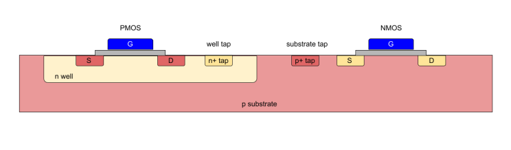
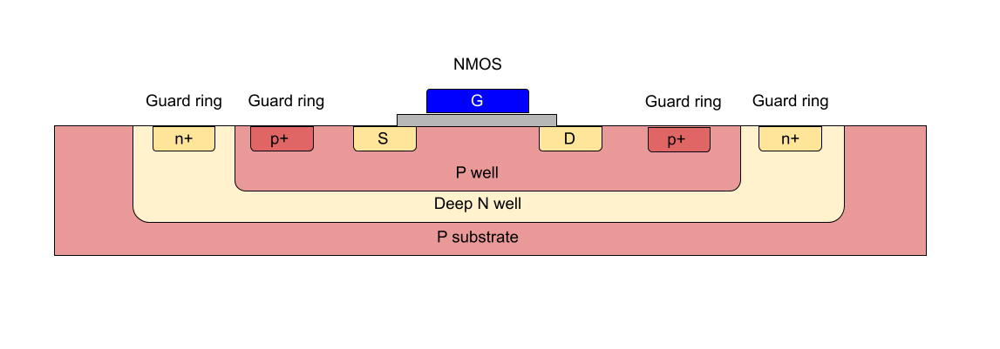
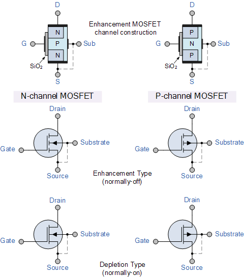
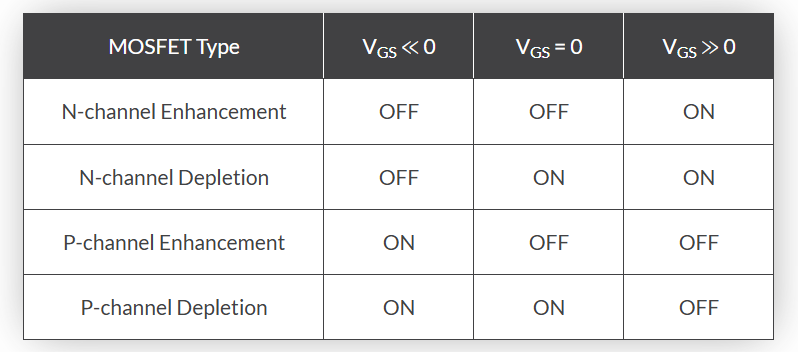

# 4.2 IHP’s SG13G2 MOSFETs

### MOSFET Types and Symbols

The SG13G2 PDK provides parameterizable MOSFET symbols in Xschem:

- **Low-Voltage MOSFETs (1.5 V)**
  - `sg13_lv_nmos`: Vth ~ 0.5 V, Lmin = 0.13 µm
  - `sg13_lv_pmos`: Vth ~ -0.47 V, Lmin = 0.13 µm

- **High-Voltage MOSFETs (3.3 V)**
  - `sg13_hv_nmos`: Vth ~ 0.7 V, Lmin = 0.45 µm
  - `sg13_hv_pmos`: Vth ~ -0.65 V, Lmin = 0.45 µm

Symbols support the configuration of width (W), length (L), and multiplier (m). **Isolated variants of NMOS are also available**. 

## What is an Isolated NMOS?

In standard CMOS, all NMOS devices share a common P-substrate, meaning they share the body terminal.

An **isolated NMOS**:
- Is fabricated inside a **deep N-well** embedded in a **P-type epitaxial layer**.
- This allows the body terminal to be independently biased.
- Provides true 4-terminal operation (G, D, S, B).

### Benefits of Isolated NMOS
- Independent body control
- Reduced parasitic coupling
- Mitigates latch-up
- Improves analog and RF performance

### CMOS Transistor Terminals (4-pin mode)

| Terminal | Symbol | Function |
|----------|--------|----------|
| Gate     | G      | Controls the channel (via voltage) |
| Drain    | D      | Where current exits the transistor |
| Source   | S      | Where current enters the transistor |
| Body     | B      | Substrate; influences threshold voltage and leakage |

## The Role of the Body Terminal

- The body terminal in an **NMOS** is typically connected to the **lowest voltage** (GND).
- This prevents the **body effect**, which increases the threshold voltage \( V_{th} \) if the source and body are not at the same potential.
- The body terminal also helps prevent **leakage** and **latch-up** issues.

  
  
<em>Figure : CMOS using normal process(not isolated)</em>

  
  
<em>Figure : Isolated NMOS</em>

# MOSFET analysis for analog design

A Metal-Oxide-Semiconductor Field-Effect Transistor (MOSFET) is a voltage-controlled semiconductor device widely used in analog and digital circuits. In analog design, MOSFETs are crucial for building amplifiers, filters, current mirrors, bias circuits, and operational transconductance amplifiers (OTAs).

- Four-terminal structure: Gate (G), Drain (D), Source (S), Bulk/Substrate (B)

### Types of MOSFETs
- **NMOS**: Conducts when \( V_{GS} > V_{TH} \), uses electrons as carriers (higher mobility).
- **PMOS**: Conducts when \( V_{SG} > |V_{TH}| \), uses holes as carriers (lower mobility).

> NMOS is preferred for speed; PMOS complements NMOS in CMOS logic for power efficiency.

### MOSFET as a Voltage-Controlled Current Source
The MOSFET allows current to flow from **drain to source**, controlled by the **gate voltage**.  
In saturation, the **drain current** is mainly controlled by **VGS**:

### Why Use MOSFETs in Analog Design?
- **Low input current** due to insulated gate (nearly zero gate current).
- **Scalability** and high integration in CMOS processes.
- **Design flexibility**: Can act as resistors, current sources, amplifiers, and switches.
- **Matching and noise performance** for precision analog blocks.

### MOSFET Symbols and Conventions

| Symbol Type      | Description                          |
|------------------|--------------------------------------|
| Enhancement-mode | Most common in CMOS (normally OFF)   |
| Depletion-mode   | Less common (normally ON)            |
| 4-Terminal       | Gate, drain, source, and bulk        |
| 3-Terminal       | Bulk tied to source (simplified view)|

  
  
<em>Figure : MOSFET symbols for each</em>

### DC Characteristics (Ideal Behavior)

| Region      | Condition                                  | Behavior                                |
|-------------|--------------------------------------------|-----------------------------------------|
| Cutoff      | \( V_{GS} < V_{TH} \)                      | MOSFET is OFF, \( I_D = 0 \)            |
| Triode      | \( V_{GS} > V_{TH}, V_{DS} < V_{GS} - V_{TH} \) | MOSFET behaves like a resistor         |
| Saturation  | \( V_{GS} > V_{TH}, V_{DS} \geq V_{GS} - V_{TH} \) | Current saturates, good for amplifiers |

  
  
<em>Figure : Switching characteristics of both the N-channel and P-channel type MOSFET.</em>

Now, in the next section we will continue to analyse the characteristics of a MOSFET.

