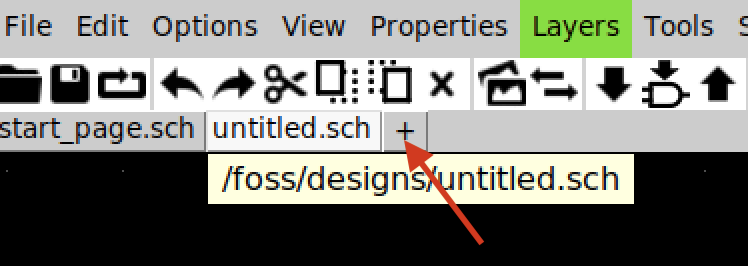
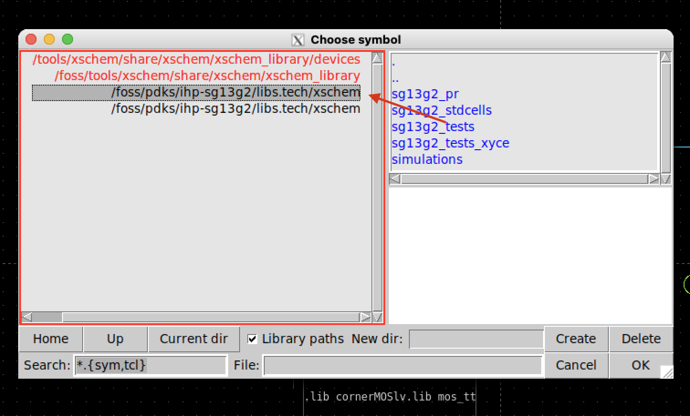
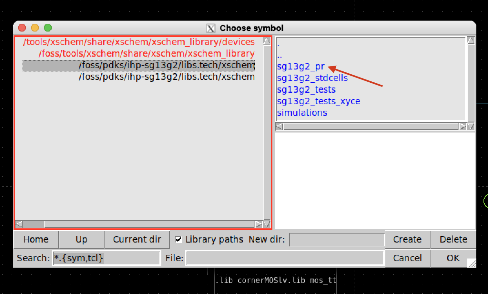
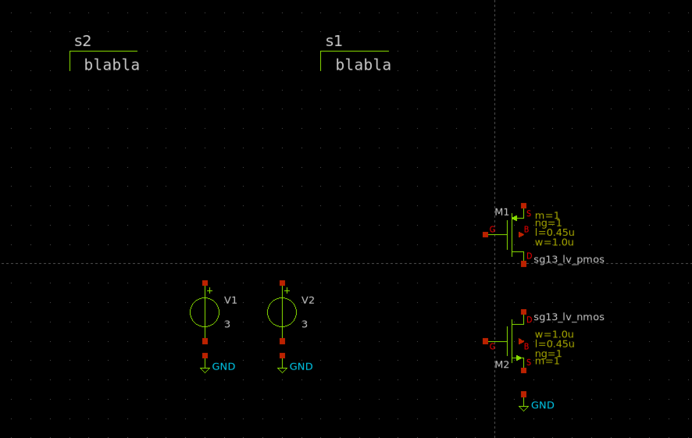
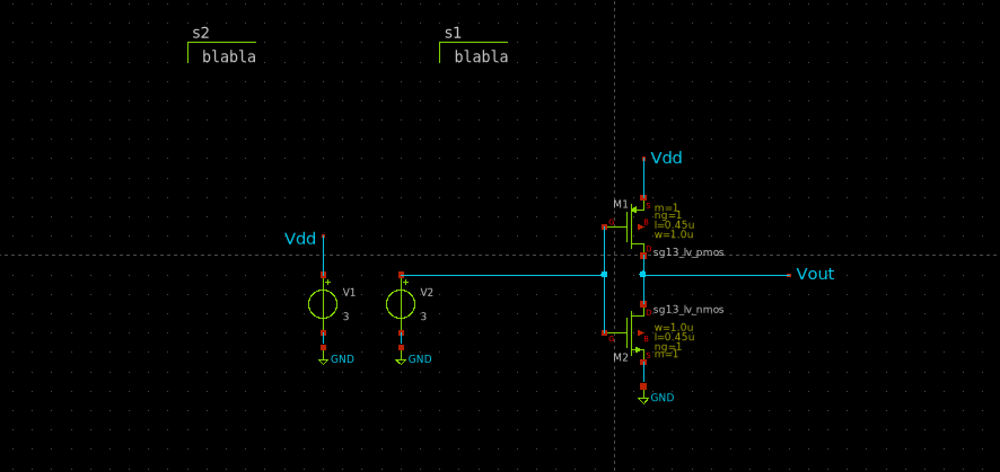
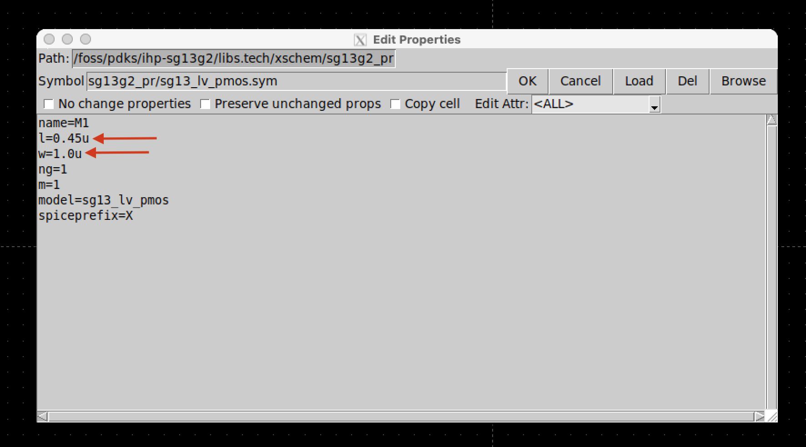

# 5.1 Design Phase

## 5.1.1 Background 

Start by opening the schematic editor **Xschem**. You can find installation instructions for the IIC OpenSource tools Docker container [here](https://github.com/iic-jku/iic-osic-tools?tab=readme-ov-file).

To begin a new schematic, click the "+" icon.

<figure>
  
  <figcaption><em>Figure 5.1.1.1: Start a new schematic by clicking the "+" icon.</em></figcaption>
</figure>

## 5.1.2 Component Selection and Placement 

For the inverter circuit, you will need the following components:
- One PMOS transistor
- One NMOS transistor
- Two voltage sources
- Two code_shown components
- Ground pins

To insert these components, navigate to the `xschem` folder located inside the `libs.tech` directory of the IHP SG13G2 PDK.

<figure>
  
  <figcaption><em>Figure 5.1.2.1: Access the component symbols as shown.</em></figcaption>
</figure>

Next, go to the **sg13g2_pr** directory:

<figure>
  
  <figcaption><em>Figure 5.1.2.2: Enter the folder containing primitive devices.</em></figcaption>
</figure>

Select the low-voltage MOSFET components:

- `sg13_lv_pmos.sym`
- `sg13_lv_nmos.sym`

Place these components on the schematic canvas. You can rotate them using `Shift + r`.

<figure>
  
  <figcaption><em>Figure 5.1.2.3: PMOS and NMOS placed on the Xschem canvas.</em></figcaption>
</figure>

Then, open the **devices** folder in the `xschem_library`.

<figure>
  
  <figcaption><em>Figure 5.1.2.4: Path to the devices folder in the Xschem library.</em></figcaption>
</figure>

Select the following additional components:

- `gnd.sym`
- `vsource.sym`
- `code_shown.sym`
- `lab_pin.sym`

Use the "c" key to copy components on the canvas.

The completed component placement should look like this:

<figure>
  
  <figcaption><em>Figure 5.1.2.5: Final component placement.</em></figcaption>
</figure>

## 5.1.3 Wiring the Components 

Use the "w" key or the wire tool to connect components. To connect nodes without visible wires, you can use `lab_pin`, which gives a cleaner and more professional layout.

<figure>
  
  <figcaption><em>Figure 5.1.3.1: Insert wire tool in Xschem.</em></figcaption>
</figure>

The complete wiring should look like this:

<figure>
  
  <figcaption><em>Figure 5.1.3.2: Final wiring of the inverter circuit.</em></figcaption>
</figure>

## 5.1.4 Setting Transistor Parameters

To adjust the **W/L ratios** of the transistors, double-click on each MOSFET and modify the values in the pop-up window.

<figure>
  
  <figcaption><em>Figure 5.1.4.1: Adjust the width-to-length ratio of MOSFETs.</em></figcaption>
</figure>

Choose W/L ratios based on the required drive strength and power supply voltage.

### Expected Characteristics of a Good Inverter Design:
- Balanced rise and fall times
- Low propagation delay
- Low power consumption

You may adjust these parameters after running simulations to meet your specific design goals. For example, increasing the W/L ratio enhances the **transconductance (gₘ)**, which can help reduce delay and increase speed.

For this design:
- PMOS W/L = 20
- NMOS W/L = 10
