# 5.2 Simulation Phase

{: .no_toc }

<details open markdown="block">
  <summary>
    Table of contents
  </summary>
  {: .text-delta }
- TOC
{:toc}
</details>

## 5.2.1 Add SPICE Code

To include a SPICE code/command, simply add a `code_shown.sym` or `code.sym` symbol:

- **code.sym**: A hidden code block that does not display the code in the interface.
- **code_shown.sym**: A visible code block that displays the code in the interface.

Both symbols function the same, but one is visible and the other is hidden.

To add one, go to:

```
Tools > Insert Symbol
```

or press `Ins` or `Shift+I`. Then search for `code_shown.sym` or `code.sym` and place it on your canvas.

<figure>
  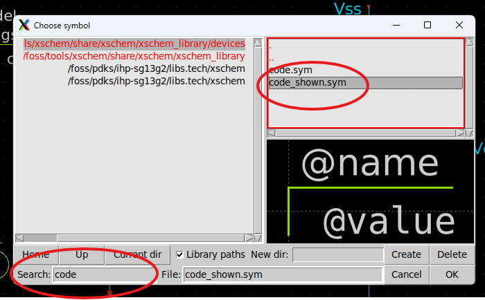
  <figcaption><em>Figure 5.2.1: Adding a code block.</em></figcaption>
</figure>

- In the **Name** field, you can assign a name to the block. It won't affect the SPICE code, but you cannot reuse the same name for multiple blocks.
- In the **Value** field, paste your SPICE commands.

<figure>
  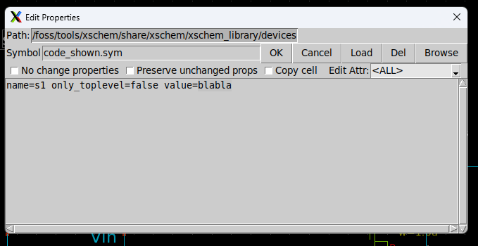
  <figcaption><em>Figure 5.2.2: Code block attributes.</em></figcaption>
</figure>

To learn more about SPICE commands, please refer to the [SPICE Quick Reference Sheet v1.0](https://web.stanford.edu/class/ee133/handouts/general/spice_ref.pdf) provided by Stanford University.

---

## 5.2.2 Include the Model Directory

Although Xschem is a GUI-based schematic editor, if you are using specific PDK devices for simulation, you must include the path to the directory containing those device models.

Basic lumped/behavioral devices can be found in the default Xschem library. However, for simulations involving process-specific design parameters, it is best to use the models or symbols provided by the PDK.

To include the model directory, follow the steps above to add a code block, double-click it, and enter the path to the model library.

Usually, the path is under:

```
/foss/pdks/ihp-sg13g2/libs.tech/ngspice/models/
```

Use:

```
.include /foss/pdks/ihp-sg13g2/libs.tech/ngspice/models/
```

For now, when using two low-voltage MOSFETs, the following command is sufficient. Then click `OK`:

```
.lib cornerMOSlv.lib mos_tt
```

<figure>
  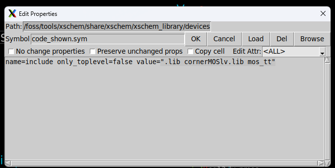
  <figcaption><em>Figure 5.2.3: Including a library file.</em></figcaption>
</figure>

---

## 5.2.3 Setting Up the Control Commands

To simulate your model, you must define the appropriate control commands. These commands depend on the type of simulation you intend to run, such as AC, DC, or transient simulations, supported by the SPICE engine.

For a transient simulation, you can use:

```
.tran 1m 1s
```

This command performs a transient simulation from 0 to 1 second with a timestep of 1 millisecond.

For more control commands, please refer to the [section 3.2](https://skillsurf.github.io/art_of_aicd/content/3.2-osic-tools.html#3-types-of-analysis) or refer to [SPICE Quick Reference Sheet v1.0](https://web.stanford.edu/class/ee133/handouts/general/spice_ref.pdf).

You can include these commands in an existing or in a new code block.

**Note**: The leading period (`.`) before commands is typically required, but if your commands are within a control code block, it may be optional depending on your simulation tool.

<figure>
  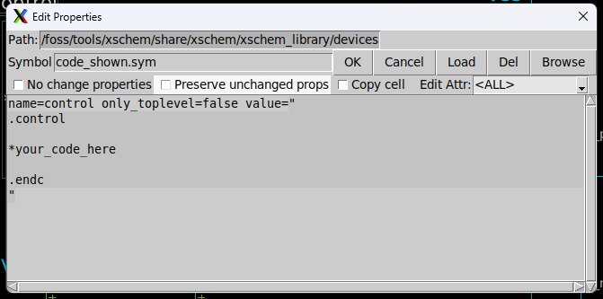
  <figcaption><em>Figure 5.2.4: Control code.</em></figcaption>
</figure>

Simply insert your commands within the code block to complete the setup. For now, we use the `.tran 1m 1s`.

Finally, you can see the codes on your canvas if you used `code_shown.sym`.

<figure>
  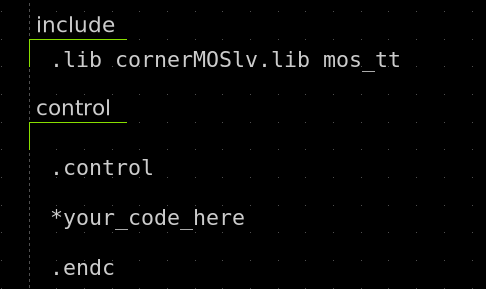
  <figcaption><em>Figure 5.2.5: code_shown.sym blocks.</em></figcaption>
</figure>

---

## 5.2.4 Generate Netlist

A **netlist** is a code-based representation of a circuit. It contains all the information about the devices used and how they are connected. This netlist is essential for simulation, as it provides SPICE-readable data.

From the Xschem GUI, you can easily generate the netlist after designing your circuit.

First, enable the setting to show the netlist after the netlist command if it isn’t already enabled.

To do that:

```
Simulation > Show netlist after netlist command
```

Or simply press `Shift + A`.

<figure>
  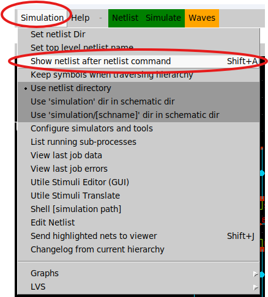
  <figcaption><em>Figure 5.2.6: Enable "Show Netlist".</em></figcaption>
</figure>

Next, click **Netlist** from the simulation options. You can find this button in the top middle of the menu bar.

<figure>
  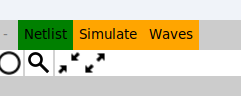
  <figcaption><em>Figure 5.2.7: Simulation options.</em></figcaption>
</figure>

Xschem will now generate the netlist. If there is an error, the netlist generation will fail and an error message will be displayed.

Otherwise, you will see the generated netlist based on your design:

<figure>
  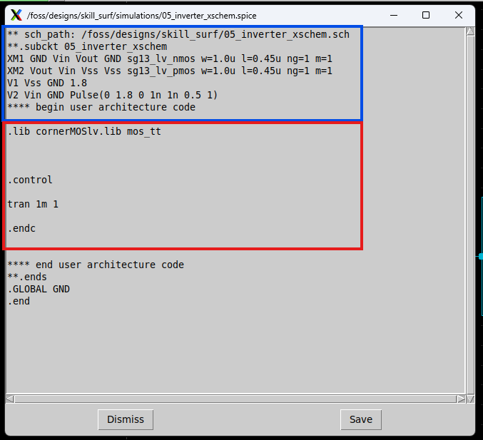
  <figcaption><em>Figure 5.2.8: Example of a generated netlist.</em></figcaption>
</figure>

The netlist includes device connections and SPICE commands. You can save it if needed—it will be saved as a `.spice` file in your project directory.

---

## 5.2.5 Simulate

After generating the netlist, you can simulate it using a SPICE simulator. Here, we use **Ngspice**.

Click **Simulate** in the simulation options. This will launch a new terminal displaying the commands being executed and the initial simulation parameters.

If no errors are shown, the simulation is successful.

<figure>
  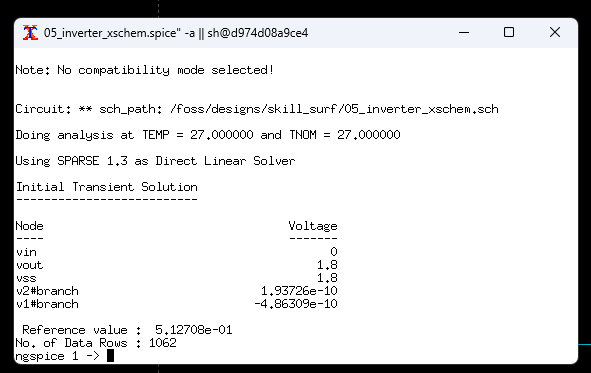
  <figcaption><em>Figure 5.2.9: Output terminal after running simulation.</em></figcaption>
</figure>

This terminal runs Ngspice and supports Ngspice commands. For example, to plot the voltage at a specific net (e.g., `vout`), type:

```
plot vout
```

<figure>
  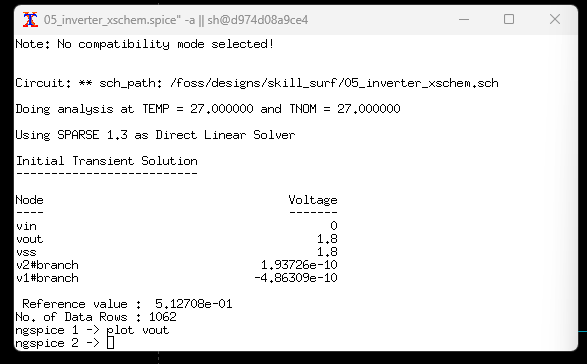
  <figcaption><em>Figure 5.2.10: Plot command.</em></figcaption>
</figure>

A new window will appear with the requested waveform.

<figure>
  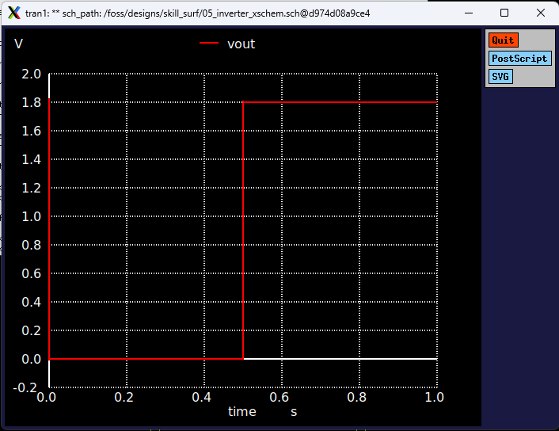
  <figcaption><em>Figure 5.2.10: Plot command.</em></figcaption>
</figure>

You can also predefine simulation results by including plotting or output commands directly in the SPICE code blocks. These will execute automatically after the simulation completes.

### Learn More?
For more spice commands and learn about ngspice please refer to the [ngspice user manual](https://ngspice.sourceforge.io/docs/ngspice-manual.pdf)