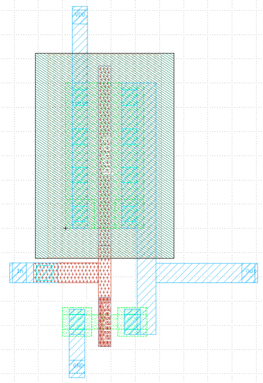
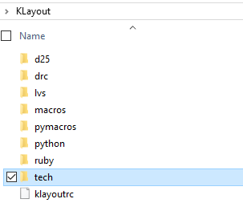
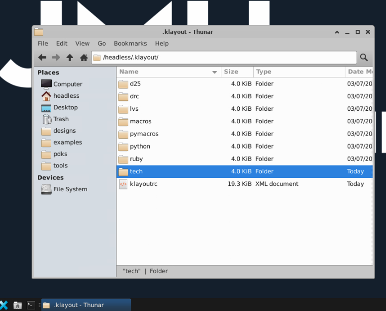
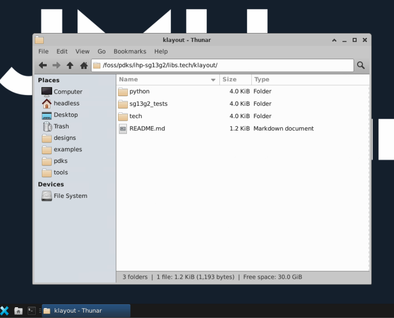
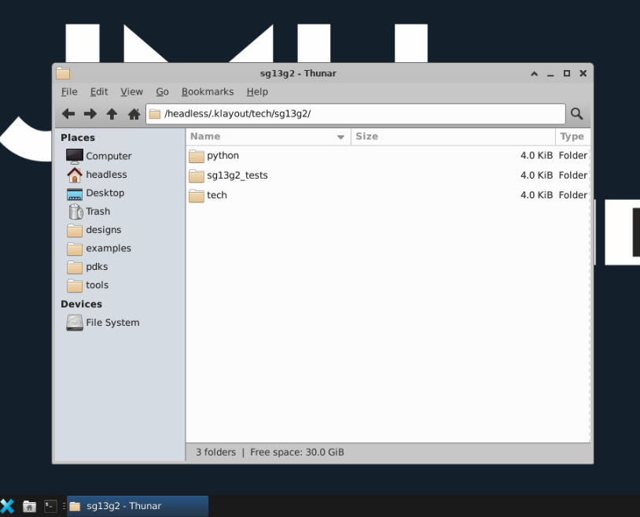
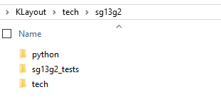
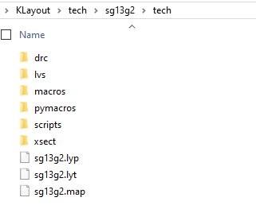
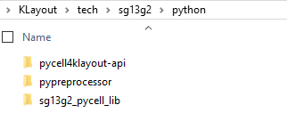
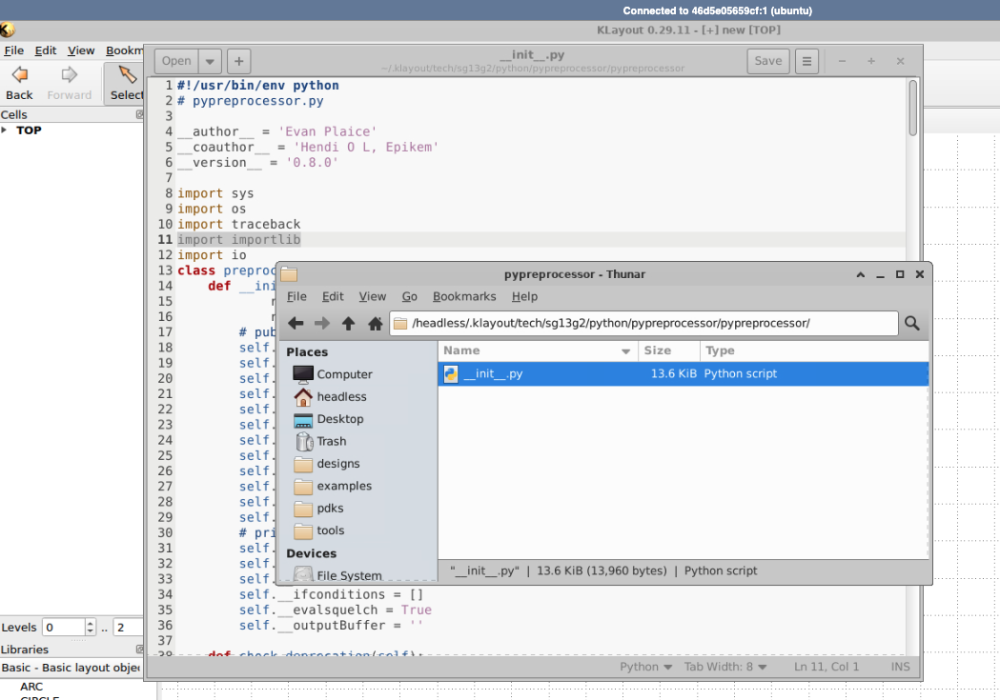

# 5.3 Layout Phase
{: .no_toc }

  

    Table of contents
  

  {: .text-delta }
- TOC
{:toc}

Creating the physical layout of the CMOS inverter is essential for fabrication and further analysis process. In this section, we are going to do layout designing and DRC handling, spice generation of layout and LVS checking using NETGEN.

## Prerequisites
- [KLayout](https://www.klayout.de/doc-qt5/manual/basic.html)
- [IHP SG13G2 PDK klayout technology library](https://github.com/IHP-GmbH/IHP-Open-PDK/tree/main/ihp-sg13g2/libs.tech/klayout)
- If not locally installing KLayout, you can also use [IIC-OSIC-TOOLS](https://github.com/iic-jku/IIC-OSIC-TOOLS) with KLayout and sg13g2 tech libraries pre-installed (Recommended for MAC users).

## Structure of the CMOS 

Before moving into layout design we have to get some idea about the physical structure of a CMOS transistor in Silicon level. This is the schematic design of the inverter.

  
  
<em>Figure: The CMOS inverter</em>

It consists of a P-type MOSFET and a N-type MOSFET, and includes key structures like diffusion areas, gate oxides, polysilicon gates, metal layers and vias etc.

  

**Active Area (Diffusion):** Regions where transistors are formed. These areas are doped to create n-type or p-type regions. 
 
 **Gate Oxide:** A thin layer of SiO₂ between the gate and the channel region of the transistor.  
 
**Polysilicon Gate:** The gate electrode controlling the transistor's operation, formed above the gate oxide.

**Contacts and Vias:** Metal connections that link the transistors to interconnect layers and power supply. 

**Metal Layers:** Conductive layers (e.g., metal1, metal2) used for interconnections between different components.

## Layout Design

This is how you connect the PMOS (top) and NMOS (bottom) transistor cells together in your layout, and also connect the VDD and GND power rails to create the inverter layout. The "In" and "Out" labels indicate the INPUT and OUTPUT ports of the inverter.

  
  
<em>Figure: CMOS inverter design in IHP SG13G2 using Klayout</em>

## KLayout Setup Steps

We start with installing [KLayout](https://www.klayout.de/doc-qt5/manual/basic.html) (if you are using a Windows PC) and opening the KLayout technology folder. In windows, this folder is usually located in `C:\Users\<username>\KLayout` and looks as shown below. If a folder called `tech` is missing inside the KLayout folder, you may create this folder yourself.

  

In IIC-OSIC-TOOLS, you will find the `.klayout` folder inside `/headless/.klayout/` as shown below. You may have to create the folder `tech` yourself. This `tech` folder is where we store all KLayout technology libraries. Hence, you need another folder called `sg13g2` inside `tech` to store the IHP SG13G2 technology libraries. These libraries are stored in the github repository: [ihp-sg13g2/libs.tech/klayout](https://github.com/IHP-GmbH/IHP-Open-PDK/tree/main/ihp-sg13g2/libs.tech/klayout).

  

In IIC-OSIC-TOOLS, you can find the technology libraries inside `/foss/pdks/ihp-sg13g2/libs.tech/klayout/`, which you can copy and paste inside `/headless/.klayout/tech/sg13g2` as shown below.

  

  

For Windows, you can download them from the github repository: [ihp-sg13g2/libs.tech/klayout](https://github.com/IHP-GmbH/IHP-Open-PDK/tree/main/ihp-sg13g2/libs.tech/klayout) and copy and paste inside `\KLayout\tech\sg13g2\` as shown below.

  

The most important technology files are inside the `\KLayout\tech\sg13g2\tech` folder as shown below.

  

## 📁 Directory: `KLayout > tech > sg13g2 > tech`

### 📄 Files

| File Name       | Type                     | Description                                                                 |
|------------------|--------------------------|-----------------------------------------------------------------------------|
| `sg13g2.lyp`     | Layer Properties File    | Defines how layers are displayed in KLayout (colors, patterns, visibility). |
| `sg13g2.lyt`     | Layout Technology File   | Contains technology-specific settings like layer mappings and design rules. |
| `sg13g2.map`     | Layer Mapping File       | Maps layer numbers/names between different formats or tools.                |

### 📁 Folders

| Folder Name | Likely Contents / Purpose                                                                 |
|-------------|--------------------------------------------------------------------------------------------|
| `drc`       | Design Rule Check scripts or configuration files.                                         |
| `lvs`       | Layout Versus Schematic rule files for verifying layout against circuit schematics.       |
| `macros`    | KLayout macros, possibly in Ruby or another supported scripting language.                 |
| `pymacros`  | Python-based macros for automating tasks in KLayout.                                      |
| `scripts`   | General-purpose scripts, possibly for setup, automation, or utilities.                    |
| `xsect`     | Likely contains cross-section related data or visualization scripts.                      |

The next important folder is the `\KLayout\tech\sg13g2\python`, which contains the following 3 folders:

  

The `pypreprocessor` and the `pycell4klayout-api` are both empty folders, if you downloaded the technology files from github (not in IIC-OSIC-TOOLS). Download these files from the links given below and put them inside the folders.
- `pypreprocessor`: https://github.com/IHP-GmbH/pycell4klayout-api/tree/047f1928ac6749d438a500c4ee90f32c879d3f11
- `pycell4klayout-api`: https://github.com/IHP-GmbH/pypreprocessor/tree/6ddd5783365718c41eb69bce4428358ace4d1fa2

{: .note-title}
> Python 3.12 error - "No module names imp"
>
> If you encounter an error such as above for imp module, then you can find details on how to fix it [here](https://stackoverflow.com/questions/77274572/multiqc-modulenotfounderror-no-module-named-imp). 

This error usually comes from the `_init_.py` file of `/headless/.klayout/tech/sg13g2/python/pypreprocessor/pypreprocessor/_init_.py` as shown below. Repacing this file with the version [here](https://github.com/IHP-GmbH/pypreprocessor/blob/master/pypreprocessor/__init__.py) may also work.

  

opening the `KLayout (Editor)` application. 

https://github.com/IHP-GmbH/IHP-Open-PDK/blob/main/ihp-sg13g2/libs.tech/klayout/tech/pymacros/autorun.lym
https://github.com/IHP-GmbH/IHP-Open-PDK/tree/main/ihp-sg13g2/libs.ref/sg13g2_pr/gds

## Layout Design Steps

### Step 2a - Inverter Layout in Magic for IHP SG13G2 130nm PDK

  

### Step 2b - Inverter Layout in KLayout for IHP SG13G2 130nm PDK

  

Extra:

https://github.com/IHP-GmbH/IHP-Open-PDK/tree/main/ihp-sg13g2/libs.tech/klayout/tech/lvs

https://github.com/IHP-GmbH/IHP-Open-PDK/tree/main/ihp-sg13g2/libs.tech/klayout/tech/xsect

## 3D Layout

Can you identify the P and N type MOSFETs? Can you see the input and output ports? Here’s a [3D view](https://legacy-gltf.gds-viewer.tinytapeout.com/?model=https://tinytapeout.github.io/sky130B-cells-gltf/cells/sky130_fd_sc_hd__inv_1.gds.gltf) of the same cell:

  
  
<em>Figure: CMOS inverter 3D design</em>

{: .note-title}
> Learning to draw a CMOS inverter?
>
> For more information, refer to these [tiny tapeout resources](https://tinytapeout.com/siliwiz/cmosinverter/).

### Design and Layout Rules

<iframe src="./slides/SG13G2_os_layout_rules.pdf" width="100%" height="620px">
  This browser does not support PDFs. Please download the PDF to view it: <a href="./slides/SG13G2_os_layout_rules.pdf">Download PDF</a>.
</iframe>
