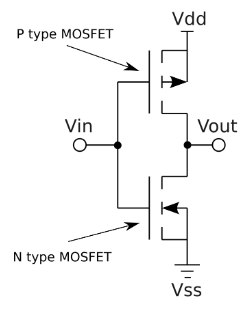
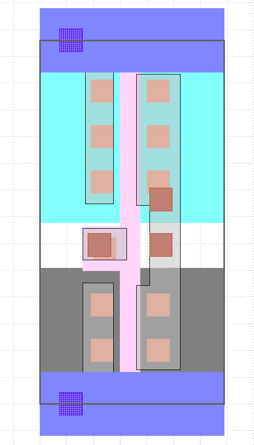
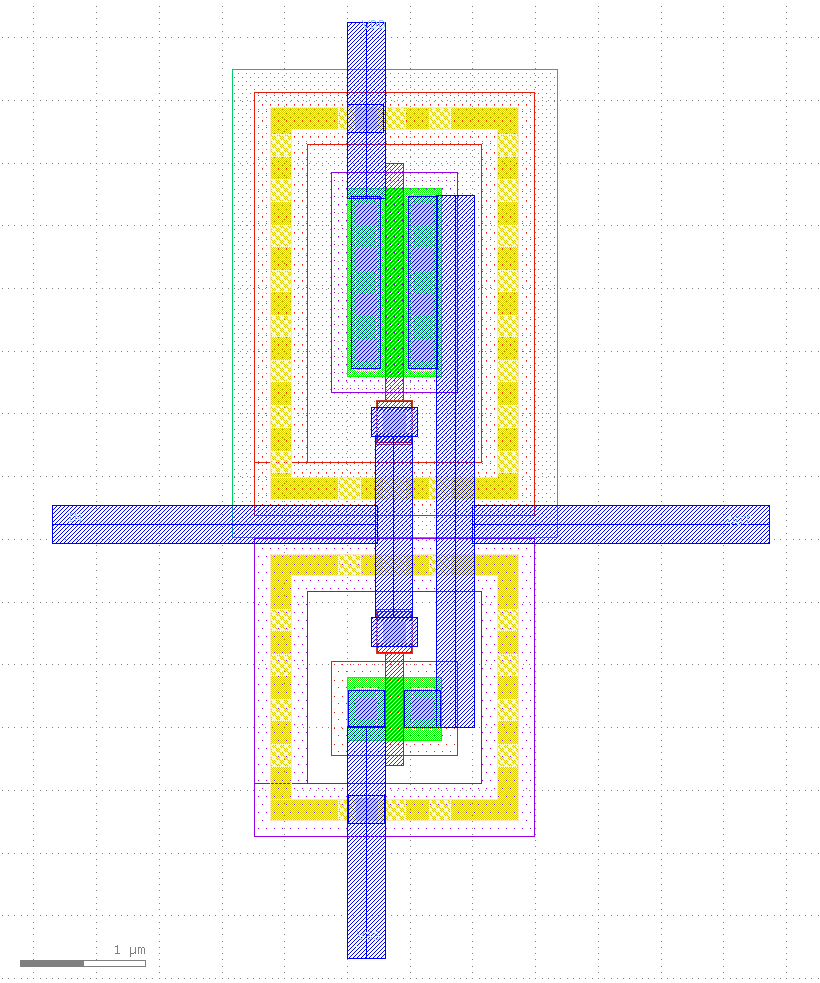
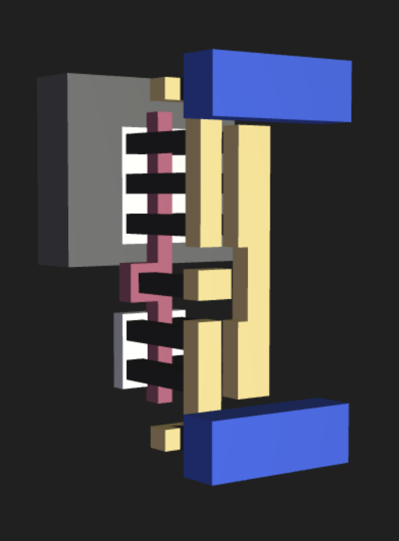

# 5.3 Layout Phase
{: .no_toc }

  

    Table of contents
  

  {: .text-delta }
- TOC
{:toc}

Creating the physical layout of the CMOS inverter is essential for fabrication and further analysis process. In this section, we are going to do layout designing and DRC handling, spice generation of layout and LVS checking using NETGEN.

## Prerequisites
- [Klayout](https://www.klayout.de/doc-qt5/manual/basic.html)
- IHP SG13G2 PDK

## Structure of the CMOS 

Before moving into layout design we have to get some idea about the physical structure of a CMOS transistor in Silicon level. This is the schematic design of the inverter.

  
  
<em>Figure: The CMOS inverter</em>

It consists of a P-type MOSFET and a N-type MOSFET, and includes key structures like diffusion areas, gate oxides, polysilicon gates, metal layers and vias etc.

  

**Active Area (Diffusion):** Regions where transistors are formed. These areas are doped to create n-type or p-type regions. 
 
 **Gate Oxide:** A thin layer of SiO₂ between the gate and the channel region of the transistor.  
 
**Polysilicon Gate:** The gate electrode controlling the transistor's operation, formed above the gate oxide.

**Contacts and Vias:** Metal connections that link the transistors to interconnect layers and power supply. 

**Metal Layers:** Conductive layers (e.g., metal1, metal2) used for interconnections between different components.

## Layout Design

This is how you connect the PMOS (top) and NMOS (bottom) transistor cells together, and also connect the VDD and GND power rails to create the inverter layout.

  
  
<em>Figure: CMOS inverter using Klayout</em>

This is how the layout looks when you do this in Klayout.

  
  
<em>Figure: CMOS inverter using Klayout</em>

https://github.com/IHP-GmbH/IHP-Open-PDK/tree/main/ihp-sg13g2/libs.tech/klayout
https://github.com/IHP-GmbH/pycell4klayout-api/tree/047f1928ac6749d438a500c4ee90f32c879d3f11
https://github.com/IHP-GmbH/pypreprocessor/tree/6ddd5783365718c41eb69bce4428358ace4d1fa2
https://github.com/IHP-GmbH/IHP-Open-PDK/blob/main/ihp-sg13g2/libs.tech/klayout/tech/pymacros/autorun.lym
https://github.com/IHP-GmbH/IHP-Open-PDK/tree/main/ihp-sg13g2/libs.ref/sg13g2_pr/gds

## KLayout Setup Steps

https://stackoverflow.com/questions/77274572/multiqc-modulenotfounderror-no-module-named-imp

## Layout Design Steps

### Step 2a - Inverter Layout in Magic for IHP SG13G2 130nm PDK

  

### Step 2b - Inverter Layout in KLayout for IHP SG13G2 130nm PDK

  

Extra:

https://github.com/IHP-GmbH/IHP-Open-PDK/tree/main/ihp-sg13g2/libs.tech/klayout/tech/lvs

https://github.com/IHP-GmbH/IHP-Open-PDK/tree/main/ihp-sg13g2/libs.tech/klayout/tech/xsect

## 3D Layout

Can you identify the P and N type MOSFETs? Can you see the input and output ports? Here’s a [3D view](https://legacy-gltf.gds-viewer.tinytapeout.com/?model=https://tinytapeout.github.io/sky130B-cells-gltf/cells/sky130_fd_sc_hd__inv_1.gds.gltf) of the same cell:

  
  
<em>Figure: CMOS inverter 3D design</em>

{: .note-title}
> Learning to draw a CMOS inverter?
>
> For more information, refer to these [tiny tapeout resources](https://tinytapeout.com/siliwiz/cmosinverter/).

### Design and Layout Rules

<iframe src="./slides/SG13G2_os_layout_rules.pdf" width="100%" height="620px">
  This browser does not support PDFs. Please download the PDF to view it: <a href="./slides/SG13G2_os_layout_rules.pdf">Download PDF</a>.
</iframe>