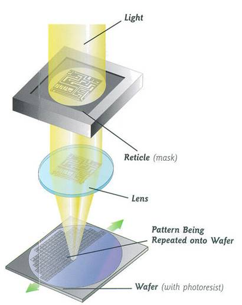

# 6.1 Process Fabrication Technology

{: .no_toc }

  

    Table of contents
  

  {: .text-delta }
- TOC
{:toc}

This section provides an overview of the main fabrication technologies involved in manufacturing Integrated Circuits on Silicon wafer. 

## Wafer Formation
The basic raw material for CMOS IC fabriation is Silicon which comes as wafers roughly 200mm in diameter and <1mm in thickness. Silicon is extracted from SiO2 that exists on earth as Quartz through a rigorous cleansing process. Wafers are cut from cylindrical ingots of single-crystal silicon, that have been pulled from a crucible of pure molten silicon. This is known as the Czochralski method and is currently the most common method for producing single-crystal material. Controlled amounts of impurities are added to the melt to provide the crystal with the required electrical properties. A seed crystal is dipped into the melt to initiate crystal growth. The silicon ingot takes on the same crystal orientation as the seed. A graphite radiator heated by radio-frequency induction surrounds the quartz crucible and maintains the temperature a few degrees above the melting point of silicon (1425 °C). The atmosphere is typically helium or argon to prevent the silicon from oxidizing.

  
  
<em>Figure: Wafer formation process flow</em>

<!--  -->

## Photolithography
 The patterning is achieved by a process called photolithography, from the Greek photo (light), lithos (stone), and graphe (picture), which literally means “carving pictures in stone using light.” The primary method for defining areas of interest (i.e., where we want material to be present or absent) on a wafer is by the use of photoresists. The wafer is coated with the photoresist and subjected to selective illumination through the photomask. A photomask is constructed with chromium (chrome) covered quartz glass. A UV light source is used to expose the photoresist. The UV light floods the mask from the backside and passes through the clear sections of the mask to expose the organic photoresist (PR) that has been coated on the wafer. A developer solution like NaOH is then used to disolve the exposed photoresist (exposed in the case of positive resist and unexposed in the case of negative resist) leaving the exposed Silicon for further procesing. The setup commercially used today is called 'Projection printing" which uses UV light sources of ~200nm wavelength. When the feature size of CMOS devices gets smaller, new lithography systems with shorter wavelengths are required and the newest addition to it is the 13.5nm EUV (Extreme UV) machine introduced by ASML. 

  

  <table>
    <tr>
      <td>
        
      </td>
      <td>
        
      </td>
    </tr>
  </table>
  
<em>Figure: PhotoLithography Process</em>

  <!--  -->

 <!--  -->

  

## Deposition
Device fabrication requires the deposition of various material on the Silicon wafer. For example, in the process of manufacturing a CMOS, several layers including gate oxide, field oxides, polysilicon gate as well as multiple interconnect metal layers are required to be deposited at different stages. Different techniques exist for the deposition of different kinds of materials based on the properties of each material as well as the impact it can create on the already fabricated part of the design on the wafer. Thermal oxidation is primarily used for the deposition of gate and field oxides in transistors while several techniques of physical & Chemical vapour deposition exists for other material which will be discussed in the below sections. 

### Thermal Oxidation
Two of the most important components of a transistor, gate oxide and the field oxide are formed using thermal oxidation method which is in simple terms depositing a SiO2 layer on top of the Si wafer. In fact, unlike other semiconductors, easy processability of the Silicon oxide is also a major reason for Silicon to be the mainstream material for electronics manufacturing. Passing any Silicon rich gas in the presence of Oxygen and under high temperature (~1200 C) allows it to react with the Si surface forming a strong SiO2 layer on top. Following images illustrates a typical oxidation chamber and the chemical reaction of the SiO2 formation. 

Depending on the purity level required, either dry oxidation or wet oxidation can be chosen with the main difference being that wet oxidation uses H2O in addition to O2 gas. In the manufacturing of CMOS, purity of the gate oxide is extremely critical since it determines many properties of the transistor such as the leakage current, threshold voltage etc. Hence, dry thermal oxidation is usually used to deposite the gate oxide layer under highly controlled conditions while wet oxidation which can create a thicker oxide layer is used to form the field oxide in the form of Shallow Trench Isolation (STI). 

  <table>
    <tr>
      <td>
        
      </td>
      <td>
        
      </td>
    </tr>
  </table>
  
<em>Figure: Thermal Oxidation Process & Chamber</em>

  
  
<em>Figure: Shallow Trench Isolation (STI) seperating two MOS devices</em>

<!--  -->

<!--  -->

<!--  -->

### Physical & Chemical vapour deposition
Based on the methodology used, deposition techniques are categorized into two, physical vapour deposition and chemical vapour deposition. As the name suggests, chemical deposition utilizes the chemical reaction of different materials under controlled conditions which untimately gets deposited on the exposed area of the Si wafer. The most common setup used for this is the Low Pressure Chemical Vapour Deposition (LPCVD). A common example for this technique would be the deposition of the Polysilicon layer for the CMOS gate which allows SiH4 gas to form a Poly-Si layer on top of the previosuly formed gate oxide layer (Poly-Si is a form of Si with a different lattice structure). Below diagrams illustrates a typical setup of a LPCVD chamber and the formation of the Polysilicon gate. 

  
  
<em>Figure: Low Pressure Chemical vapour Deposition (LPCVD) chamber</em>

  <table>
    <tr>
      <td>
        
      </td>
      <td>
        
      </td>
    </tr>
  </table>
  
<em>Figure: Polysilicon Gate structuring using LPCVD</em>

<!--  -->

Physical vapour deposition on the contrary uses physical bombardment of high speed particles of a target material on the Silicon surface under controlled conditions. The most common technique used in the industry for this is 'Sputtering' which makes use of plasma which is considered the fourth state of matter. A plasma is generated inside the chamber by introducing an electric field accross the two ends followed by introducing an inert gas like Argon. The accelerated electrons in the plasma ionizes the Ar atoms which in turn attacks the target material (ex: Aluminium) with high velocity. The detached metal atoms then gets deposited on the wafer surface which is position at the opposite end of the chamber. This method is primarily used in the deposition of Aluminium for interconenct layers (Nowadays, a Al-Cu alloy is being used for interconnects). Shown below is a typical structuring of metal interconnects and a Sputtering chamber. 

  
  
<em>Figure: Sputtering Process</em>

  
  
<em>Figure: Contact and Metal Structuring</em>

<!--  -->

<!--  -->

## Etching
The etching of the materials is also a crucial step. For example, contact windows with very small dimensions, e.g., 0.3 μm × 0.3 μm, and relatively large depths, e.g., 2 μm, must be etched with high precision. Depending on the speed, accuracy, and selectivity required in the etching step, and the type of material to be etched, one of these methods may be used: (1) “wet” etching, i.e., placing the wafer in a chemical liquid (low precision); (2) “plasma” etching, i.e., bombarding the wafer with a plasma gas (high precision); (3) reactive ion etching (RIE), where ions produced in a gas bombard the wafer. This RIE is very commonly used in most of the etching processes in modern manufacturing systems due to its high level of precision. Shown below is a diagram of the RIE process. 

  
  
<em>Figure: Reactive Ion Etching</em>

## Doping (Ion Implantation & diffusion)
Dopants need to be selectively introduced into the wafer at different fabrication steps.  For example, after the lithography of the first mask, the n-well is formed by entering dopants into the exposed silicon area (Phosporous). Similarly, the source and drain regions of transistors require selective addition of dopants to the wafer The most common method of introducing dopants is “ion implantation,” whereby the doping atoms are accelerated as a high-energy focused beam, hitting the surface of the wafer and penetrating the exposed areas. The doping level (dosage) is determined by the intensity and duration of the implantation, and the depth of the doped region is set by the energy of the beam.

Ion implantation damages the silicon lattice extensively. For this reason, the wafer is subsequently heated to approximately 1,000◦C for 15 to 30 minutes, allowing the lattice bonds to form again. Called “annealing,” this operation also leads to diffusion of dopants, broadening the profile in all directions. For example, annealing results in side diffusion of S/D regions, creating overlap with the gate area. The wafer is therefore usually annealed only once, after all implantations have been completed.

The follwoing diagrams illustrates the doping of different regions during CMOS manufacturing. 

  
  
<em>Figure: Doping - Implantation & Diffusion</em>

  <table>
    <tr>
      <td>
        
      </td>
      <td>
        
      </td>
    </tr>
  </table>
  
<em>Figure: N-type & P-type Implantation</em>

<!--  -->

## References

1. [Inside the cleanroom How Microchips are made - IHP](https://www.youtube.com/watch?v=NrpBc5NssvQ&t=14s)
2. Design of Analog CMOS Integrated Circuits - by Behzad Razavi
3. CMOS VLSI Design, A circuits and Systems perspective - Neil H.E. Weste, David Money Harris