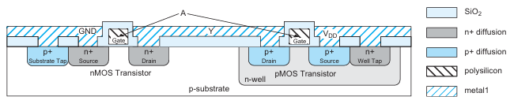
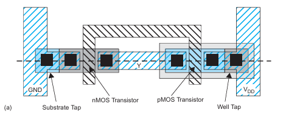
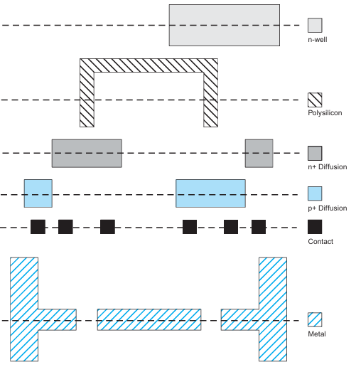
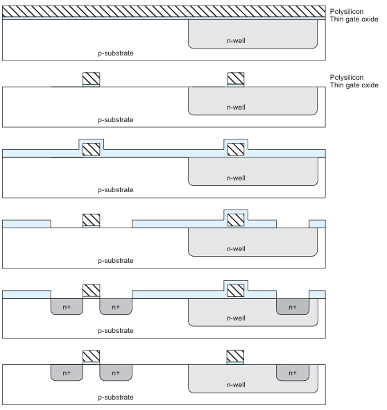
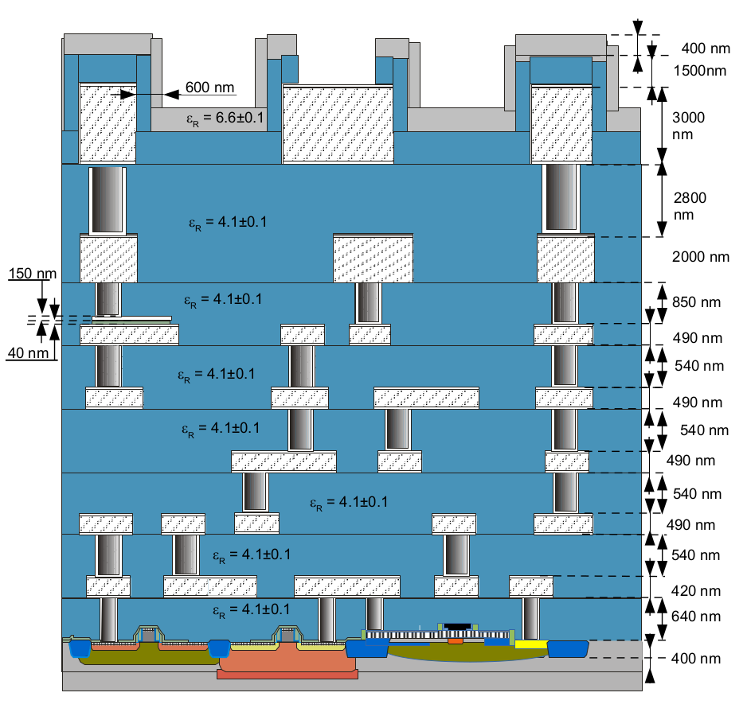

# 6.2 CMOS Fabrication Flow
This section provides a step by step guide on how a CMOS inverter is fabricated using the GDS file generated during the design stage and the fabrication technologies introduced in the previous section. 

Figure below shows the cross section of a CMOS inverter. 

  
  
<em>Figure: CMOS Inverter cross-section</em>

In this diagram, the inverter is built on a p-type substrate. The pMOS transistor requires an n-type body region, so an n-well is diffused into the substrate in its vicinity. The n-MOS transistor has heavily doped n-type source and drain regions and a polysilicon gate over a thin layer of silicon dioxide (SiO2, also called *gate oxide*). n+ and p+ diffusion regions indicate heavily doped n-type and p-type silicon. The pMOS transistor is a similar structure with p-type source and drain regions. The polysilicon gates of the two transistors are tied together to form the input A. The source of the nMOS transistor is connected to a metal ground line and the source of the pMOS transistor is connected to a metal VDD line. The drains of the two transistors are connected with metal to form the output Y. A thick layer of SiO2 called field oxide prevents metal from shorting to other layers except where contacts are explicitly etched. 

The inverter could be defined by a hypothetical set of six masks: n-well, polysilicon, n+ diffusion, p+ diffusion, contacts, and metal. The figures below shows the top view of an inverter and the corresponding masks extracted from it for manufacturing.

  
  
<em>Figure: CMOS Inverter top view</em>

  
  
<em>Figure: CMOS Inverter fabrication masks</em>

The first step of the process is the creation of a n-well in the p-type silicon substrate (wafer) using the first mask shown above. Formation of the n-well requires the implantation of a group V element; typically Phosphorous(P) into the substrate in the area defined by the mask. In order to prevent rest of the substrate from being doped, a protective layer of SiO2 is deposited over the entire wafer followed by photolithography to transfer the pattern in the mask indicating the exact location the n-well needs to be formed. The oxide is then etched with hydrofluoric acid (HF) where it is not protected by the photoresist. The well is formed in the region where the wafer is now exposed using ion implantation. Finally, the remaining oxide is stripped with HF to leave the bare wafer with wells in the appropriate places. The diagram below shows the step by step process of this n-well formation. 

  
  
<em>Figure: N-well manufacturing steps</em>

The field oxide is formed next to seperate the NMOS and the PMOS. The traditional approach for the formation of this field oxide is called *"Local Oxidation of Silicon(LOCOS)"* method. However, due to several drawbacks of it in manufacturing nanometer range nodes, the latest technique used today is *"Silicon trench Isolation(STI)"* which is described in section 6.1. 

The transistor gates are formed next. These consist of polycrystalline silicon, generally called polysilicon, over a thin layer of oxide. The thin oxide is grown in a furnace using the technique dry thermal oxidation. Then the wafer is placed in a reactor with silane gas (SiH4) and heated again to grow the polysilicon layer through Low Pressure chemical vapor deposition(LPCVD) process. The polysilicon is heavily doped to form a reasonably good conductor. As earlier, the wafer is patterned with photoresist and the polysilicon mask, leaving the polysilicon gates atop the thin gate oxide. 

As the next step, n+ source and drain regions of the NMOS are formed. Prior to doping, a protective layer of oxide is deposited using LPCVD and pattered with the n-diffusion mask (3rd mask from above) to expose the area where dopants are needed. P dopants are then introduced using Ion implantation technique. Polysilicon gate over the nMOS transistor blocks the diffusion so the source and drain are separated by a channel under the gate. This is called a self-aligned process because the source and drain of the transistor are automatically formed adjacent to the gate without the need to precisely align the masks. Finally, the protective oxide is stripped. This step by step process is illustrated in the diagram below. 

  
  
<em>Figure: Poli gate & NMOS source and drain formation</em>

The process is repeated for the p-diffusion mask to form the PMOS. An oxide layer of Borophosphosilicateglass(BPSG) is grown to insulate the wafer from metal and patterned with the contact mask (5th mask from above) to leave contact cuts where metal should attach to diffusion or polysilicon. Finally, aluminum is sputtered over the entire wafer using Sputtering technique, filling the contact cuts as well. The metal is patterned with the metal mask (6th mask from above) and plasma etched using RIE technique to remove metal everywhere except where wires should remain. In modern CMOS inverters, a multiple layers of metal are patterned which is a repetition of this last step multiple times. For example, the BiCMOS node used in our designs contains 7 layers of metal (Aluminium). A final cross-sectional view of the IHP BiCMOS is shown below for further understanding. 

  
  
<em>Figure: Cross-section view of the IHP BiCMOS node</em>

Eventhough the entire flow of fabricating a CMOS inverter was explained here using less than 20 steps, the actual manufacturing of a single CMOS involves more than 50 steps and requires careful handling of the wafers at every step to maintain the purity of the device. 