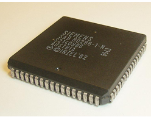
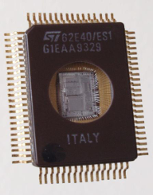
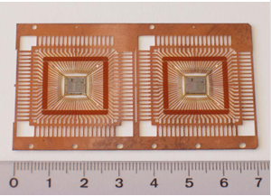
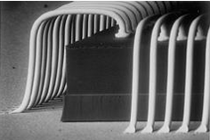
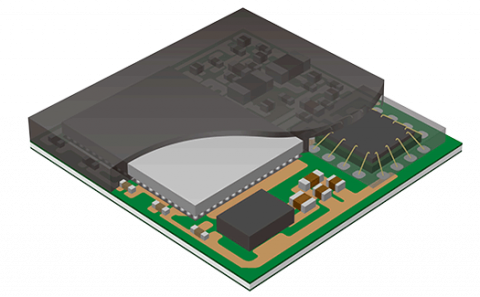

# 6.3 Modern Chip Packaging

In the world of microelectronics, the term packaging is refered to as assembling, contacting and packaging of ICs. Under this process, the chips are electrically connected with the outer world and also necessary measures are taken to protect the chip from inteferences from the environment such as EMI. 

There are multiple materials used in packaging of integrated circuits such as 
- Glass
- Metal
- Ceramic

  <table>
    <tr>
      <td>
        
      </td>
      <td>
        
      </td>
      <td>
        
      </td>
    </tr>
  </table>
  
<em>Figure: Packaging</em>

The main process steps involved in packaging and assembling of the chips post-fabrication process are listed below with a short explanation of each. 

- Selecting functioning units - This is the step which immediately follows the fabrication process where the fabricated wafer is tested for any fabrication defects. Any such defects are color marked for identification. 

- Seperating into individual chips - As the next step, the chips are seperated using Diamond sawing of the full wafer followed by water cooling. 

- Dice bonding onto the carrier - This is the next step where the die (chip) is attached to the package on it's backside. There are several ways of doing it depending on the tyope of the substrate; gluing, soldering and alloying. gluing is the simple method of applying glue on the packaging material and attaching the chip on top of it. Soldering can be performed in the case of the packaging material being a metal (metal soldering) or glass/ceramic (glass soldering). The third technique, alloying is also used with metal substrates, but by forming a metallic bond by alloying the metal and the semiconductor at relatively high temperatures (350C). 

- Electrical contacting - These are the interconnections made for the chip with the external substrates. The three most common techniques used today are Wire bonding (WB), Tape Automated Bonding (TAB) and Flip Chip (FC). Out of these, wire bonding is the most widely used technique which connects a bond pad on the chip with a counter contact on the substrate with a bond wire. Typical material used for these wires are Aluminium or Aluminium-Silicon alloys of diameter ~20-50um. One speciality of this technique is that it allows wiring of chips of any height. The below videos provides a more comprehensive understanding of the wire bonding process and different types of wire bonding including ball bonding, wedge bonding & Ribbon bonding. 

  
  
<em>Figure: Wire Bonding</em>

    <table>
        <tr>
            4
            
        </tr>
    </table>

<!-- 

  

 -->

- Encapsulation - This is the final stage where the ICs are stacked and encapsulated on a final packaging. 

  
  
<em>Figure: Encapsulation</em>

