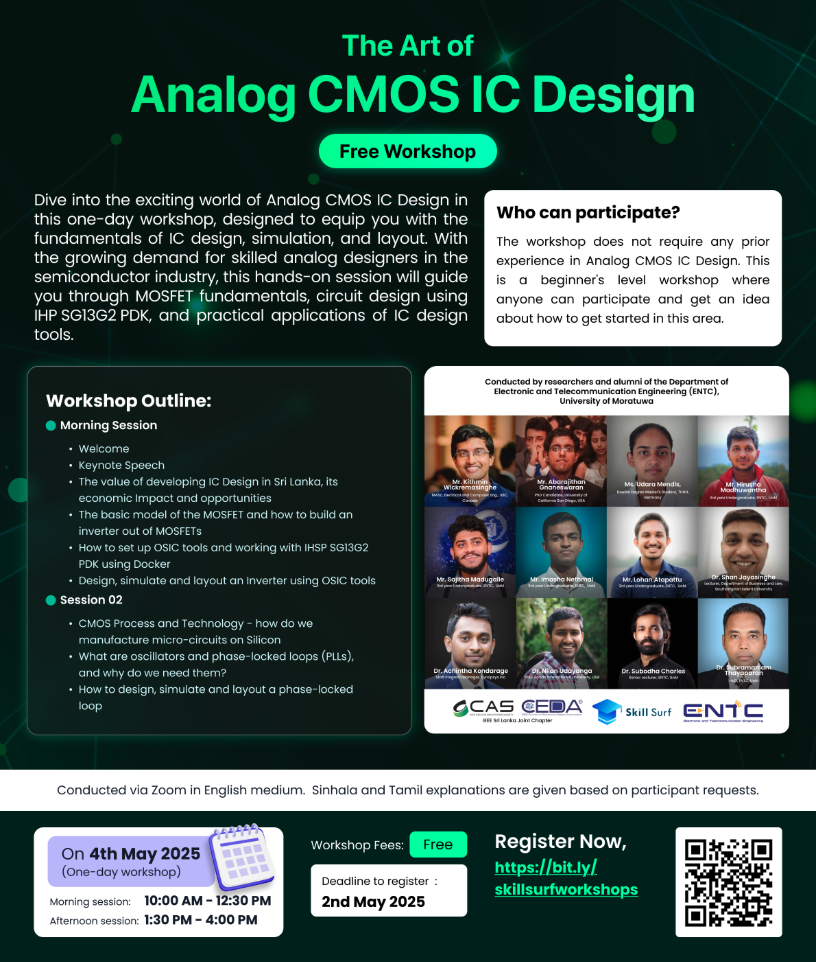

The Art of Analog CMOS IC Design Workshop is your gateway to mastering the fundamentals of analog circuit design, simulation, and layout. Whether you’re a student, researcher, or industry professional, this workshop provides hands-on experience with real-world applications. No prior experience in IC design is required—just a passion for electronics and a desire to explore the world of semiconductor technology. By the end of this workshop, you’ll have the skills to design, simulate, and layout analog circuits using open source, setting you on the path to becoming a skilled IC designer.

The workshop will cover the fundamentals of Analog IC Design, Simulation, and Layout, and is organized by alumni of the Department of Electronic & Telecommunication Engineering, University of Moratuwa together with Skill Surf.

1. Morning Session (10 am to 12.30 pm)
    - Welcome Speech by Dr. Subramaniam Thayaparan
    - Awareness for CASS CEDA SL by Mr. Kavinga Upul Ekanayaka
    - “Unlocking Sri Lanka's Potential in the Integrated Circuit Industry: Opportunities, Challenges, and the Role of Policy in Driving Semiconductor Innovation” by Dr. Shan Jayasinghe
    - Why should you choose a career in IC design? Keynote Speech by Dr. Nilan Udayanga
    - The basic model of the MOSFET and how to build an inverter out of MOSFETs
    - Introduction to Inverter and the Analog IC Design flow
    - How to set up OSIC tools and work with IHSP SG13G2 PDK using Docker
    - Working with IHP SG13G2 PDK using Docker

2. Afternoon Session (1.30 pm to 4.00 pm)
    - Design, simulate, layout and post-layout an Inverter using OSIC tools
    - CMOS Process and Technology - how do we manufacture micro-circuits on Silicon
    - What are Oscillators and phase-locked loops (PLLs), and why do we need them?
    - How to design, simulate and layout a Phase-locked Loop (PLL)
    - Measurement Demo using AD3 and Tiny Tapeout 7
    - Course Outline of ""

  
  
<em>Figure: Workshop Flyer</em>

